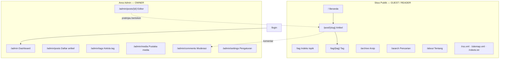
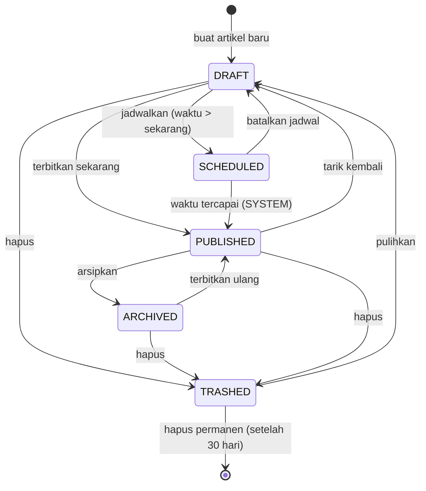
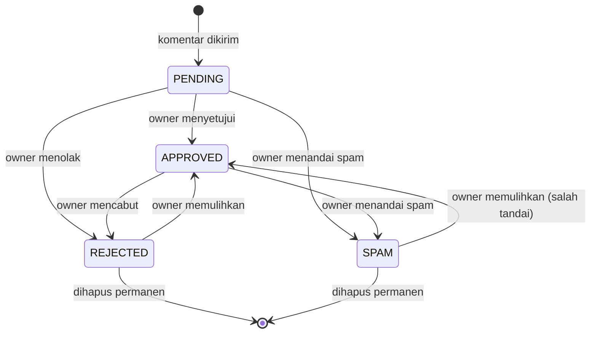

# FRD — Functional Requirements Document
**Proyek:** Blog Pribadi (codename: `blogspot`)
**Versi:** 1.0 (Draft)
**Tanggal:** 2026-10-03
**Dokumen hulu:** [BRD.md](./BRD.md) · [PRD.md](./PRD.md)
**Status:** Draft — menunggu review

---

## 1. Tujuan & Cara Membaca Dokumen Ini

Dokumen ini menjabarkan **perilaku sistem secara fungsional** — apa yang terjadi pada setiap input, aturan validasi, hasil, dan penanganan kesalahan. Dokumen ini **tidak** membahas pilihan teknologi (lihat [TRD.md](./TRD.md)).

**Format setiap requirement:**

| Bagian | Isi |
|---|---|
| **Aktor** | Siapa yang memicu |
| **Prakondisi** | Keadaan yang harus terpenuhi sebelumnya |
| **Input & validasi** | Data masuk dan aturan penerimaannya |
| **Proses** | Langkah yang dijalankan sistem |
| **Output / pascakondisi** | Hasil yang terlihat dan perubahan status |
| **Error** | Kondisi gagal dan responsnya |

**Peran yang dikenal sistem:**

| Peran | Keterangan |
|---|---|
| `GUEST` | Pengunjung tanpa sesi |
| `READER` | Pengguna terautentikasi tanpa hak administratif |
| `OWNER` | Pemilik blog; satu-satunya peran dengan akses `/admin` |
| `SYSTEM` | Proses terjadwal/otomatis (mis. publikasi terjadwal) |

---

## 2. Peta Modul & Navigasi

| Modul | Kode | Cakupan | Rentang ID |
|---|---|---|---|
| Autentikasi & Akun | **M1** | Login, sesi, otorisasi, peran | FR-001 … FR-006 |
| Manajemen Artikel | **M2** | Siklus hidup artikel, slug, penjadwalan | FR-020 … FR-029 |
| Editor | **M3** | Penyuntingan konten | FR-030 … FR-036 |
| Media | **M4** | Unggah & pengelolaan gambar | FR-040 … FR-043 |
| Tampilan Publik | **M5** | Halaman yang dilihat pembaca | FR-050 … FR-059 |
| SEO & Distribusi | **M6** | Metadata, sitemap, RSS, data terstruktur | FR-060 … FR-065 |
| Komentar | **M7** | Pengiriman & moderasi komentar | FR-070 … FR-076 |
| Dashboard Admin | **M8** | Ringkasan, daftar, audit, pengaturan, kelola tag | FR-080 … FR-084 |

---

## 3. Matriks Peran × Hak Akses

✅ = diizinkan · ⚠️ = diizinkan bersyarat · ❌ = ditolak

| Aksi | GUEST | READER | OWNER |
|---|:---:|:---:|:---:|
| Melihat artikel berstatus `PUBLISHED` | ✅ | ✅ | ✅ |
| Melihat artikel `DRAFT` / `SCHEDULED` | ❌ | ❌ | ✅ |
| Membuka pratinjau draf bertoken | ⚠️ token valid | ⚠️ token valid | ✅ |
| Melihat komentar `APPROVED` | ✅ | ✅ | ✅ |
| Melihat komentar `PENDING`/`REJECTED`/`SPAM` | ❌ | ❌ | ✅ |
| Mengirim komentar | ⚠️ bila komentar tamu diaktifkan | ✅ | ✅ |
| Menyunting/menghapus komentar sendiri | ❌ | ❌ | ✅ |
| Masuk ke `/admin` | ❌ | ❌ | ✅ |
| CRUD artikel | ❌ | ❌ | ✅ |
| Menerbitkan / menjadwalkan artikel | ❌ | ❌ | ✅ |
| Mengunggah / menghapus media | ❌ | ❌ | ✅ |
| Memoderasi komentar | ❌ | ❌ | ✅ |
| Mengubah pengaturan situs | ❌ | ❌ | ✅ |
| Mengekspor seluruh konten | ❌ | ❌ | ✅ |

> **Aturan penegakan:** otorisasi diperiksa **di sisi server pada setiap aksi**, bukan sekadar menyembunyikan elemen antarmuka. Menyembunyikan tombol adalah urusan tampilan, bukan keamanan.

---

## 4. Modul M1 — Autentikasi & Akun

### FR-001 · Masuk dengan OAuth
> Memenuhi US-001, US-005 · BR-07

| | |
|---|---|
| **Aktor** | `GUEST` |
| **Prakondisi** | Penyedia OAuth terkonfigurasi |
| **Input & validasi** | Pilihan penyedia; sistem memvalidasi `state` dan menukar kode otorisasi di sisi server |
| **Proses** | 1) Alihkan ke penyedia · 2) Terima callback · 3) Verifikasi · 4) Cari atau buat pengguna berdasarkan email terverifikasi · 5) Tetapkan peran per **FR-003** · 6) Buat sesi |
| **Output** | Sesi aktif; `OWNER` dialihkan ke tujuan semula atau `/admin`, `READER` kembali ke halaman asal |
| **Error** | Pengguna membatalkan → kembali ke `/login` dengan pesan netral · `state` tidak cocok → tolak (`E-AUTH-02`) · email tidak terverifikasi di penyedia → tolak (`E-AUTH-03`) |

### FR-002 · Proteksi area administratif
> Memenuhi US-002 · BR-07

| | |
|---|---|
| **Aktor** | Semua |
| **Prakondisi** | — |
| **Proses** | Setiap permintaan ke `/admin/*` dan setiap aksi tulis administratif diperiksa: sesi ada **dan** peran = `OWNER` |
| **Output** | Diizinkan, atau dialihkan ke `/login?next=<tujuan>` bila tanpa sesi, atau halaman 403 bila `READER` |
| **Error** | Sesi kedaluwarsa saat aksi tulis → aksi dibatalkan, isian editor dipertahankan di klien, pengguna diminta masuk ulang (`E-AUTH-01`) |

> **Catatan desain:** halaman 403 untuk `READER` sengaja tidak mengungkap apakah sumber daya yang diminta ada.

### FR-003 · Penetapan peran owner
> Memenuhi US-003 · BR-07, BR-08

| | |
|---|---|
| **Aktor** | `SYSTEM` |
| **Prakondisi** | Daftar email owner telah ditetapkan di konfigurasi lingkungan |
| **Proses** | Saat pengguna dibuat atau masuk: bila email terverifikasi ada di daftar owner → peran `OWNER`; selain itu → `READER` |
| **Output** | Peran tersimpan pada data pengguna |
| **Error** | Daftar owner kosong saat penyiapan → aplikasi menolak start di lingkungan produksi (`E-CFG-01`) |

> **BRULE-01:** Peran `OWNER` **tidak pernah** dapat diperoleh lewat pendaftaran mandiri — hanya lewat konfigurasi lingkungan yang dikendalikan pemilik deployment.

### FR-004 · Keluar & masa berlaku sesi
> Memenuhi US-004

| | |
|---|---|
| **Aktor** | `READER`, `OWNER` |
| **Proses** | Keluar menghapus sesi di server dan membersihkan cookie |
| **Output** | Pengguna kembali menjadi `GUEST`, diarahkan ke beranda |
| **Aturan** | **BRULE-02:** masa berlaku sesi `OWNER` lebih pendek daripada `READER`, dan diperbarui saat ada aktivitas |

### FR-005 · Model pengguna & peran
> Memenuhi US-005 · BR-07, BR-08

| | |
|---|---|
| **Deskripsi** | Sistem menyimpan satu entitas pengguna dengan atribut peran bernilai enumerasi, bukan penanda biner "admin/bukan admin" |
| **Alasan** | Memungkinkan penambahan peran (mis. `AUTHOR`, `EDITOR`) di v2 **tanpa migrasi destruktif** — memenuhi BR-08 |
| **Aturan** | **BRULE-03:** satu alamat email = satu pengguna; masuk dengan penyedia berbeda memakai email terverifikasi yang sama akan **menautkan akun**, bukan menduplikasinya |

### FR-006 · Catatan aktivitas administratif *(Could — v1.1)*
> Memenuhi US-006

Mencatat aksi `OWNER` yang berdampak: terbit, batal terbit, hapus, pulihkan, keputusan moderasi, dan perubahan pengaturan. Detail disiplin penyimpanan dijabarkan pada **FR-082**.

---

## 5. Modul M2 — Manajemen Artikel

### 5.1 Status Artikel

**Transisi yang diizinkan per peran**

| Transisi | OWNER | SYSTEM |
|---|:---:|:---:|
| `DRAFT → PUBLISHED` | ✅ | ❌ |
| `DRAFT → SCHEDULED` | ✅ | ❌ |
| `SCHEDULED → PUBLISHED` | ✅ (manual lebih awal) | ✅ (saat waktu tercapai) |
| `PUBLISHED → DRAFT / ARCHIVED` | ✅ | ❌ |
| `* → TRASHED` | ✅ | ❌ |
| `TRASHED → DRAFT` | ✅ | ❌ |
| `TRASHED → dihapus permanen` | ✅ (eksplisit) | ✅ (otomatis setelah 30 hari) |

> **BRULE-04:** Hanya artikel berstatus `PUBLISHED` yang boleh muncul di halaman publik, sitemap, RSS, pencarian, dan daftar artikel terkait.
> **BRULE-05:** `TRASHED` adalah **hapus lunak**. Data tetap tersimpan minimal 30 hari sebelum layak dihapus permanen.

### FR-020 · Membuat artikel baru
> Memenuhi US-010 · BR-01, BR-08

| | |
|---|---|
| **Aktor** | `OWNER` |
| **Input & validasi** | Tidak ada input wajib di awal — artikel dibuat kosong |
| **Proses** | Membuat entitas artikel dengan status `DRAFT`, penulis = pengguna saat ini, judul sementara, dan slug sementara yang unik |
| **Output** | Editor terbuka dan siap diketik dalam ≤ 1 interaksi dari dashboard |
| **Aturan** | **BRULE-06:** setiap artikel selalu terhubung ke satu penulis; relasi dirancang satu-ke-banyak agar v2 dapat menambah penulis tanpa mengubah struktur |

### FR-021 · Penyimpanan draf & autosave
> Memenuhi US-011 · BR-01, BR-02

| | |
|---|---|
| **Aktor** | `OWNER` |
| **Prakondisi** | Editor terbuka pada artikel yang ada |
| **Input & validasi** | Isi konten; panjang maksimum dibatasi (lihat Lampiran A) |
| **Proses** | 1) Perubahan dikumpulkan dan disimpan setelah jeda **3 detik** sejak ketikan terakhir · 2) Penyimpanan juga dipicu saat editor kehilangan fokus · 3) Penyimpanan bersifat idempoten per artikel |
| **Output** | Indikator status: `Menyimpan…` → `Tersimpan HH:MM` |
| **Error** | Gagal jaringan → indikator `Gagal menyimpan — mencoba lagi`, isi dipertahankan secara lokal, percobaan ulang otomatis dengan jeda bertingkat (`E-POST-05`) · Saat meninggalkan halaman dengan perubahan belum tersimpan → konfirmasi peramban |
| **Aturan** | **BRULE-07:** autosave **tidak pernah** mengubah status artikel. Draf tetap `DRAFT`; artikel `PUBLISHED` yang sedang disunting tetap `PUBLISHED` dan perubahannya baru tampil publik setelah disimpan secara eksplisit (lihat FR-026) |

### FR-022 · Metadata artikel
> Memenuhi US-014 · BR-02

| | |
|---|---|
| **Aktor** | `OWNER` |
| **Input & validasi** | **Judul**: wajib sebelum terbit, 1–200 karakter · **Ringkasan**: opsional, maks 300 karakter; bila kosong, dibentuk otomatis dari 160 karakter pertama konten · **Gambar sampul**: opsional, harus merujuk media yang sudah diunggah · **Tanggal terbit**: terisi otomatis, dapat disesuaikan |
| **Proses** | Validasi dijalankan di server; aturan yang sama diterapkan di klien hanya untuk umpan balik cepat |
| **Output** | Metadata tersimpan dan dipakai oleh modul SEO (M6) |
| **Error** | Judul kosong saat mencoba terbit → `E-POST-01` · Ringkasan melebihi batas → `E-POST-02` |

### FR-023 · Pembuatan & validasi slug
> Memenuhi US-015 · BR-02

| | |
|---|---|
| **Aktor** | `OWNER` |
| **Input & validasi** | Slug: huruf kecil, angka, dan tanda hubung; 3–120 karakter; tidak diawali/diakhiri tanda hubung; tidak boleh bertabrakan dengan rute yang dipesan (`admin`, `api`, `login`, `search`, `archive`, `tag`, `about`, `rss.xml`, `sitemap.xml`, `robots.txt`) |
| **Proses** | 1) Slug dibentuk otomatis dari judul (transliterasi, spasi → tanda hubung, karakter non-alfanumerik dibuang) · 2) Keunikan diperiksa; bila bentrok, ditambahkan sufiks angka · 3) Owner dapat menimpa secara manual selama artikel **belum pernah terbit** |
| **Output** | Slug unik tersimpan |
| **Error** | Format tidak valid → `E-POST-03` · Sudah dipakai → `E-POST-04` dengan saran alternatif |
| **Aturan** | **BRULE-08:** setelah artikel pernah berstatus `PUBLISHED`, mengubah slug **wajib** memicu pencatatan riwayat slug dan pengalihan permanen (FR-027). Antarmuka memberi peringatan eksplisit sebelum perubahan disimpan |

### FR-024 · Tag artikel
> Memenuhi US-014, US-052 · BR-02

| | |
|---|---|
| **Aktor** | `OWNER` |
| **Input & validasi** | 0–5 tag per artikel; tiap tag 2–30 karakter; dinormalisasi menjadi huruf kecil; duplikat digabungkan |
| **Proses** | Editor menampilkan **saran dari tag yang sudah ada** saat owner mengetik, beserta jumlah pemakaiannya, sehingga tag lama dipakai ulang alih-alih dibuat kembar. Tag yang belum ada akan dibuat; relasi artikel–tag bersifat banyak-ke-banyak |
| **Antarmuka** | Chip yang dapat dihapus + kolom ketik dengan daftar saran. Dapat dioperasikan penuh dengan keyboard: `Enter`/`,` menambah, `Backspace` menghapus chip terakhir, `↑`/`↓` memilih saran, `Esc` menutup |
| **Output** | Tag tampil di halaman artikel dan menghasilkan halaman tag (FR-052) |
| **Error** | Melebihi 5 tag → `E-POST-06` |
| **Aturan** | **BRULE-09:** tag tanpa artikel `PUBLISHED` tidak menghasilkan halaman publik dan tidak masuk sitemap |

### FR-025 · Menerbitkan & menjadwalkan
> Memenuhi US-017 · BR-02

| | |
|---|---|
| **Aktor** | `OWNER` (manual), `SYSTEM` (terjadwal) |
| **Prakondisi** | Judul dan konten tidak kosong; slug valid |
| **Input & validasi** | Mode: *terbitkan sekarang* atau *jadwalkan*; waktu jadwal wajib di masa depan |
| **Proses** | **Terbitkan sekarang:** status → `PUBLISHED`, `publishedAt` diisi, halaman publik terkait di-revalidasi. **Jadwalkan:** status → `SCHEDULED`; proses terjadwal memeriksa secara berkala dan mempromosikan artikel yang waktunya telah tiba |
| **Output** | Artikel dapat diakses publik; beranda, arsip, halaman tag, sitemap, dan RSS ikut diperbarui |
| **Error** | Prasyarat tidak lengkap → `E-POST-01` dan daftar bidang yang kurang · Waktu jadwal di masa lalu → `E-POST-07` |
| **Aturan** | **BRULE-10:** publikasi terjadwal dieksekusi oleh proses terjadwal, bukan oleh kunjungan pembaca. Toleransi keterlambatan yang dapat diterima: ≤ 15 menit |

### FR-026 · Menyunting artikel yang sudah terbit
> Memenuhi US-018 · BR-02, BR-08

| | |
|---|---|
| **Aktor** | `OWNER` |
| **Proses** | Perubahan disimpan secara eksplisit; `updatedAt` diperbarui; seluruh halaman publik yang menampilkan artikel ini di-revalidasi |
| **Output** | Versi terbaru tampil di situs publik dalam **≤ 5 detik** tanpa proses deploy |
| **Error** | Gagal revalidasi → perubahan tetap tersimpan, kegagalan dicatat, dan sistem mencoba ulang (`E-POST-08`) |
| **Aturan** | **BRULE-11:** menyunting artikel terbit **tidak** mengubah `publishedAt`. Penyuntingan ringan tidak memengaruhi urutan kronologis |

### FR-027 · Riwayat slug & pengalihan permanen
> Memenuhi US-018 · BR-04

| | |
|---|---|
| **Aktor** | `SYSTEM` |
| **Prakondisi** | Slug artikel yang pernah terbit diubah |
| **Proses** | Slug lama dicatat ke daftar riwayat milik artikel tersebut. Permintaan ke slug lama dijawab dengan pengalihan **301** ke slug aktif |
| **Output** | Tautan lama yang sudah tersebar dan terindeks tetap berfungsi |
| **Error** | Slug baru bertabrakan dengan slug historis artikel lain → ditolak (`E-POST-04`) |
| **Aturan** | **BRULE-12:** slug historis dipesan secara permanen dan tidak boleh dipakai ulang oleh artikel lain |

### FR-028 · Arsip, hapus lunak, dan pulihkan
> Memenuhi US-019

| | |
|---|---|
| **Aktor** | `OWNER` |
| **Proses** | **Arsipkan:** status → `ARCHIVED`; artikel hilang dari daftar publik dan sitemap, namun URL langsung tetap dapat diakses owner. **Hapus:** status → `TRASHED` beserta stempel waktu. **Pulihkan:** `TRASHED` → `DRAFT` |
| **Output** | Perubahan visibilitas tercermin di seluruh halaman publik setelah revalidasi |
| **Error** | Mencoba memulihkan artikel yang slug-nya kini dipakai artikel lain → sistem meminta slug baru (`E-POST-04`) |
| **Aturan** | **BRULE-13:** URL artikel `ARCHIVED` harus memberi sinyal de-indeks yang eksplisit kepada mesin pencari — bukan 404 yang ambigu |

> **⚠ Deviasi implementasi (BRULE-13).** Next.js 16 hanya menyediakan `notFound()`, `forbidden()`, dan `unauthorized()` — yaitu 404/403/401. **Tidak ada API untuk mengirim 410 dari page component.**
> Mitigasi yang terpasang: halaman penjelas khusus ("Tulisan ini sudah diarsipkan") + `robots: noindex` lewat `generateMetadata` + header `X-Robots-Tag: noindex` dari proxy (`src/proxy.ts`). Sinyal de-indeks tetap tegas dan tidak tertukar dengan halaman hilang biasa, meski kode statusnya 200.
> Akan ditinjau ulang bila Next.js menambahkan dukungan status kustom.

### FR-029 · Pratinjau draf bertoken
> Memenuhi US-016 · BR-02

| | |
|---|---|
| **Aktor** | `OWNER`, atau siapa pun yang memegang token |
| **Input & validasi** | Token pratinjau yang bersifat acak dan sulit ditebak |
| **Proses** | Token dibuat per artikel, dapat dicabut dan dibuat ulang oleh owner. Halaman dirender memakai tata letak publik yang identik, dengan spanduk penanda "Pratinjau" |
| **Output** | Halaman pratinjau yang merepresentasikan hasil akhir secara akurat |
| **Error** | Token tidak ada, salah, atau sudah dicabut → **404** (bukan 403, agar tidak mengonfirmasi keberadaan draf) |
| **Aturan** | **BRULE-14:** halaman pratinjau wajib dirender dinamis, tidak boleh di-cache, dan harus menyertakan direktif `noindex` |

---

## 6. Modul M3 — Editor

### FR-030 · Pemformatan teks
> Memenuhi US-012 · BR-02

Mendukung lewat toolbar **dan** pintasan Markdown saat mengetik: heading tingkat 2–4, tebal, miring, coret, daftar berurut & tak berurut, daftar tugas, kutipan, garis pemisah, tautan, kode sebaris, dan tabel sederhana.

| | |
|---|---|
| **Validasi** | Heading tingkat 1 **dicegah** di dalam isi artikel — H1 dipesan untuk judul artikel demi struktur dokumen dan SEO yang benar |
| **Error** | Struktur tidak valid dinormalisasi secara diam-diam, bukan ditolak |
| **Aturan** | **BRULE-15:** editor adalah antarmuka; **sumber kebenaran isi artikel adalah teks Markdown** (FR-035), bukan HTML hasil render |

### FR-031 · Blok kode
> Memenuhi US-012 · BR-02

| | |
|---|---|
| **Input & validasi** | Bahasa pemrograman opsional; bahasa yang tidak dikenal akan dirender tanpa pewarnaan, bukan menimbulkan galat |
| **Proses** | Pewarnaan sintaks dilakukan **saat render di sisi server**, bukan dengan memuat pustaka besar di peramban pembaca |
| **Output** | Blok kode terbaca, dapat digulir horizontal, dan menyediakan tombol salin |
| **Aturan** | **BRULE-16:** halaman publik tidak boleh memuat pustaka pewarnaan sintaks di sisi klien — mendukung anggaran performa (BR-05) |

### FR-032 · Menyisipkan gambar
> Memenuhi US-013 · BR-02

| | |
|---|---|
| **Input & validasi** | Seret-dan-lepas, tempel dari papan klip, atau pemilih berkas; batasan mengikuti **FR-041** |
| **Proses** | Unggah berjalan di latar belakang; placeholder tampil lebih dulu dan diganti setelah unggah selesai; teks alternatif diminta saat penyisipan |
| **Output** | Referensi gambar tertanam di Markdown beserta teks alternatifnya |
| **Error** | Unggah gagal → placeholder diganti pesan galat yang dapat dicoba ulang; isi tulisan tidak terganggu (`E-MEDIA-03`) |
| **Aturan** | **BRULE-17:** teks alternatif bersifat **wajib** sebelum artikel dapat diterbitkan; gambar murni dekoratif ditandai eksplisit sebagai dekoratif (mendukung US-056) |

### FR-033 · Tautan & sematan
> Memenuhi US-012

Tautan internal dan eksternal didukung. Tautan eksternal dirender dengan atribut keamanan yang tepat. Sematan v1 terbatas pada tautan biasa — **tidak ada** sematan skrip pihak ketiga, demi performa dan keamanan.

### FR-034 · Jumlah kata & waktu baca
> Memenuhi US-020

Jumlah kata diperbarui langsung saat mengetik. Estimasi waktu baca dihitung dari jumlah kata (asumsi 200 kata/menit, dibulatkan ke atas, minimum 1 menit) dan ditampilkan di halaman publik.

### FR-035 · Format penyimpanan konten
> Memenuhi US-021 · BR-01, BR-08

| | |
|---|---|
| **Deskripsi** | Isi artikel disimpan sebagai **Markdown/MDX dalam bentuk teks biasa**, bukan sebagai HTML atau format biner milik editor tertentu |
| **Alasan** | Menjamin portabilitas (BR-01): konten tetap dapat dibaca, dicari, dan dipindahkan meskipun editor atau kerangka kerja diganti |
| **Aturan** | **BRULE-18:** HTML mentah di dalam konten dibatasi pada daftar elemen aman yang diizinkan; elemen di luar itu dihapus saat render (lihat FR-051 dan TS-06) |

### FR-036 · Ekspor konten
> Memenuhi US-021 · BR-01, BR-07

| | |
|---|---|
| **Aktor** | `OWNER` |
| **Proses** | Menghasilkan arsip berisi satu berkas Markdown per artikel, dilengkapi *front matter* (judul, slug, tanggal, tag, status) serta daftar referensi media |
| **Output** | Berkas arsip yang dapat diunduh |
| **Error** | Ekspor melebihi batas waktu → dibentuk secara bertahap, bukan gagal total (`E-SYS-02`) |
| **Aturan** | **BRULE-19:** ekspor harus dapat dijalankan kapan saja tanpa bergantung pada akses basis data langsung — inilah mekanisme keluar yang memitigasi risiko R-4 |

---

## 7. Modul M4 — Media

### FR-040 · Unggah gambar

| | |
|---|---|
| **Aktor** | `OWNER` |
| **Input & validasi** | Lihat **FR-041** |
| **Proses** | Berkas disimpan di penyimpanan objek dengan nama acak (bukan nama asli); metadata (dimensi, ukuran, tipe, teks alternatif) dicatat |
| **Output** | URL publik yang stabil untuk gambar |
| **Error** | Penyimpanan tidak tersedia → `E-MEDIA-03`; artikel tetap dapat disimpan tanpa gambar tersebut |
| **Aturan** | **BRULE-20:** nama berkas asli tidak pernah dipakai pada URL — mencegah kebocoran informasi dan tabrakan nama |

### FR-041 · Batasan berkas

| Aturan | Nilai |
|---|---|
| Tipe yang diterima | JPEG, PNG, WebP, AVIF, GIF, SVG\* |
| Ukuran maksimum per berkas | 5 MB |
| Dimensi maksimum | 4000 × 4000 piksel |
| Jumlah unggahan bersamaan | 5 |

\* **BRULE-21:** SVG hanya diterima setelah disanitasi dari skrip dan referensi eksternal; bila sanitasi tidak dapat dijamin, SVG ditolak (`E-MEDIA-02`).

> **Error** — Tipe tidak didukung → `E-MEDIA-01` · Melebihi ukuran → `E-MEDIA-02` dengan menyebut batas yang berlaku

### FR-042 · Pustaka media & penghapusan

| | |
|---|---|
| **Aktor** | `OWNER` |
| **Proses** | Menampilkan daftar media beserta informasi pemakaiannya. Menghapus media yang **sedang dipakai** memunculkan peringatan dan membutuhkan konfirmasi |
| **Output** | Media terhapus dari penyimpanan dan dari basis data |
| **Aturan** | **BRULE-22:** menghapus media tidak mengubah isi artikel; referensi yang rusak ditampilkan sebagai placeholder yang jelas, bukan gambar rusak tanpa penjelasan |

### FR-043 · Penyajian gambar
> Memenuhi US-036 · BR-05

Gambar disajikan dalam ukuran responsif dan format modern, selalu dengan dimensi eksplisit untuk mencegah pergeseran tata letak (CLS). Gambar di bawah lipatan dimuat secara malas; gambar sampul utama dimuat dengan prioritas tinggi.

---

## 8. Modul M5 — Tampilan Publik

### FR-050 · Beranda
> Memenuhi US-050 · BR-05

Menampilkan identitas blog secara ringkas, lalu daftar artikel `PUBLISHED` terbaru (10 teratas) berisi judul, ringkasan, tanggal, waktu baca, dan tag. Tersedia tautan ke arsip lengkap. Keadaan kosong (belum ada artikel) ditampilkan secara sopan, bukan halaman kosong.

### FR-051 · Halaman artikel
> Memenuhi US-051 · BR-05

| | |
|---|---|
| **Isi** | Judul (H1), tanggal terbit, waktu baca, tag, gambar sampul, isi artikel, blok komentar (FR-070), dan tautan artikel sebelumnya/berikutnya |
| **Proses render** | Markdown dirender **di sisi server** menjadi HTML yang sudah disanitasi |
| **Error** | Slug tidak dikenal → **404** · Slug historis → **301** ke slug aktif (FR-027) · Artikel `ARCHIVED` → **410** (BRULE-13) |
| **Aturan** | **BRULE-23:** halaman artikel harus dapat dibaca sepenuhnya **tanpa JavaScript**. JavaScript hanya menambah fitur (tombol salin, pengirim komentar), bukan prasyarat untuk membaca |

### FR-052 · Halaman tag
> Memenuhi US-052

Menampilkan daftar artikel `PUBLISHED` untuk satu tag, diurutkan dari terbaru, dengan paginasi. Tag tanpa artikel terbit → **404** (BRULE-09).

### FR-053 · Arsip & paginasi
> Memenuhi US-053

Daftar seluruh artikel `PUBLISHED` dikelompokkan per tahun. Paginasi memakai URL **berbasis path** yang dapat ditautkan (`/archive`, `/archive/page/2`) — bukan gulir tak berujung, dan bukan parameter kueri.

> **Catatan implementasi:** path dipilih, bukan `?page=2`, karena halaman yang bergantung pada `searchParams` dipaksa menjadi dinamis oleh Next.js. Itu akan melanggar BRULE-26 dan membuat setiap permintaan pembaca menyentuh basis data. Pola yang sama berlaku untuk `/tag/<slug>/page/<n>`.

> **Aturan** — **BRULE-24:** ukuran halaman tetap 20 artikel; halaman melebihi jumlah yang tersedia → **404**

### FR-054 · Pencarian
> Memenuhi US-054

| | |
|---|---|
| **Input & validasi** | Kata kunci 2–100 karakter |
| **Proses** | Pencocokan pada judul, ringkasan, isi, **dan nama tag** artikel `PUBLISHED`; hasil diurutkan berdasarkan relevansi lalu kebaruan. Mencari "keamanan" menemukan artikel bertag keamanan meski kata itu tidak muncul di teksnya |
| **Output** | Daftar hasil dengan cuplikan; keadaan kosong menyarankan penelusuran lewat tag |
| **Error** | Kueri terlalu pendek → formulir menampilkan petunjuk, bukan galat |
| **Aturan** | **BRULE-25:** halaman hasil pencarian ditandai `noindex` agar tidak menghasilkan halaman tipis di indeks mesin pencari |

> Terkait **OQ-7**: pendekatan pencarian (kueri sederhana vs. full-text search) ditentukan di TRD berdasarkan keputusan tersebut.

### FR-055 · Halaman statis
> Memenuhi US-058

Halaman "Tentang" wajib ada di v1. Isinya dikelola owner melalui pengaturan situs (FR-083) atau sebagai artikel bertipe halaman.

### FR-056 · Tema terang & gelap
> Memenuhi US-055 · BR-05

Mengikuti preferensi sistem secara bawaan, dengan opsi pengguna untuk menimpa dan preferensinya diingat. Tema diterapkan **sebelum paint pertama** agar tidak terjadi kedipan warna terang di mode gelap.

### FR-057 · Aksesibilitas & responsivitas
> Memenuhi US-056 · BR-05

| Aspek | Ketentuan |
|---|---|
| Standar | WCAG 2.1 level AA |
| Kontras | ≥ 4,5:1 untuk teks biasa; ≥ 3:1 untuk teks besar — pada kedua tema |
| Struktur | Satu H1 per halaman; urutan heading tidak melompat |
| Keyboard | Seluruh elemen interaktif dapat dijangkau; indikator fokus terlihat jelas; tersedia tautan "lewati ke konten" |
| Semantik | Mark-up `<article>`, `<nav>`, `<main>`, `<time>` dipakai sesuai makna |
| Responsif | Titik henti minimum 320 px; target sentuh ≥ 44 × 44 px |
| Gerak | Menghormati preferensi pengurangan animasi |

### FR-058 · Penyajian statis halaman publik
> Memenuhi US-035, US-037 · BR-03, BR-05

| | |
|---|---|
| **Deskripsi** | Seluruh halaman publik dilayani sebagai HTML yang sudah dirender dari cache tepi, **tanpa kueri basis data pada jalur permintaan pembaca** |
| **Pemicu pembaruan** | Halaman di-revalidasi ketika terjadi perubahan konten (terbit, sunting, arsip, hapus, atau keputusan moderasi komentar) |
| **Output** | Halaman tetap tersaji normal meskipun basis data sedang dalam kondisi suspend |
| **Aturan** | **BRULE-26:** satu-satunya halaman yang boleh dirender dinamis adalah pratinjau draf (FR-029), hasil pencarian (FR-054), dan seluruh area `/admin` |

### FR-059 · Indeks topik
> Memenuhi US-052 · BR-04

| | |
|---|---|
| **Aktor** | `GUEST`, `READER` |
| **Deskripsi** | Halaman `/tag` memuat seluruh topik yang memiliki artikel terbit, beserta jumlah artikel per topik, diurutkan dari yang paling banyak dibahas |
| **Proses** | Data berasal dari kueri ter-cache; halaman dirender statis (BRULE-26) |
| **Output** | Pembaca dapat menelusuri seluruh kategori tulisan dari satu halaman; URL masuk sitemap |
| **Aturan** | BRULE-09 tetap berlaku — topik tanpa artikel `PUBLISHED` tidak ditampilkan dan tidak masuk sitemap |

---

## 9. Modul M6 — SEO & Distribusi

### FR-060 · Metadata per halaman
> Memenuhi US-030 · BR-04

| Halaman | Judul | Deskripsi |
|---|---|---|
| Beranda | Nama blog + tagline | Deskripsi situs |
| Artikel | Judul artikel + nama blog | Ringkasan artikel |
| Tag | `Tag: {nama}` + nama blog | Deskripsi tag yang dibentuk otomatis |
| Arsip | `Arsip` + nama blog | Deskripsi statis |
| Pencarian | `Pencarian` + nama blog | `noindex` |

Setiap halaman menyertakan judul, deskripsi, URL kanonik, serta tag Open Graph dan Twitter Card. Deskripsi dipangkas pada batas kata, bukan di tengah kata.

### FR-061 · Gambar pratinjau sosial otomatis
> Memenuhi US-031 · BR-04

Gambar Open Graph dibuat otomatis per artikel berisi judul, nama blog, dan elemen identitas visual. Bila artikel memiliki gambar sampul, sampul tersebut yang dipakai. Ukuran keluaran 1200 × 630 piksel.

> **Error** — Pembuatan gambar gagal → gunakan gambar OG bawaan situs, **jangan** sampai menggagalkan render halaman (`E-SEO-01`)

**Catatan implementasi.** Sampul dipakai sebagai **latar**, bukan menggantikan seluruh gambar: judul, nama blog, dan lama baca tetap ditulis di atasnya dengan peredup gradien dan bayangan teks, sehingga pratinjau tetap membawa identitas situs pada sampul seterang apa pun. Sampul diambil lebih dulu dan disematkan sebagai data URI (`src/lib/og-image.ts`) — hanya skema `http`/`https` dan jalur absolut yang diterima, dengan batas 8 MB dan tenggat 5 detik. Sampul yang tidak terjangkau, bukan gambar, atau terlalu besar membuat gambar mundur ke kartu judul tanpa menggagalkan build (`E-SEO-01`).

Halaman non-artikel (beranda, arsip, `/tag`, pencarian, tentang) memakai gambar OG bawaan situs berisi nama blog dan tagline (`src/app/opengraph-image.tsx`).

### FR-062 · Sitemap
> Memenuhi US-032 · BR-04

Memuat beranda, seluruh artikel `PUBLISHED`, halaman tag yang memiliki artikel terbit, arsip, dan halaman statis — masing-masing dengan `lastmod`. **Tidak memuat**: draf, terjadwal, terarsip, terhapus, halaman pratinjau, hasil pencarian, dan seluruh rute `/admin`. Sitemap diperbarui otomatis saat konten berubah.

### FR-063 · robots.txt
> Memenuhi US-032

Mengizinkan perayapan situs publik; melarang `/admin`, `/api`, dan rute pratinjau; mencantumkan lokasi sitemap.

### FR-064 · Feed RSS
> Memenuhi US-034

Memuat 20 artikel `PUBLISHED` terbaru beserta judul, tautan, tanggal terbit, ringkasan, dan isi lengkap. Ditemukan otomatis lewat tag `<link>` pada setiap halaman.

### FR-065 · Data terstruktur & kanonikal
> Memenuhi US-033 · BR-04

Setiap halaman artikel menyertakan data terstruktur tipe artikel (judul, tanggal terbit, tanggal modifikasi, penulis, gambar, deskripsi) dan tautan kanonik absolut. Halaman dengan paginasi memiliki kanonik per halaman, bukan menunjuk ke halaman pertama.

> **Aturan** — **BRULE-27:** seluruh URL dalam metadata, sitemap, RSS, dan data terstruktur harus **absolut** dan memakai domain kanonik, termasuk di lingkungan pratinjau

---

## 10. Modul M7 — Komentar

### 10.1 Status Komentar

> **BRULE-28:** hanya komentar `APPROVED` yang dirender publik **dan** dihitung dalam jumlah komentar.
> **BRULE-29:** seluruh transisi status komentar hanya dapat dilakukan `OWNER`.

### FR-070 · Mengirim komentar (pengguna terautentikasi)
> Memenuhi US-040 · BR-06

| | |
|---|---|
| **Aktor** | `READER`, `OWNER` |
| **Prakondisi** | Artikel `PUBLISHED` dan komentarnya terbuka (FR-076) |
| **Input & validasi** | Isi: 3–3.000 karakter, tidak boleh hanya spasi; maksimum 3 tautan |
| **Proses** | Simpan dengan status `PENDING`; kaitkan ke pengguna dan artikel; terapkan pemeriksaan FR-072 |
| **Output** | Pesan konfirmasi: komentar diterima dan menunggu moderasi |
| **Error** | Terlalu pendek/panjang → `E-CMT-01` · Terlalu banyak tautan → `E-CMT-02` · Komentar ditutup → `E-CMT-05` |

### FR-071 · Mengirim komentar (tamu)
> Memenuhi US-041 · BR-06

| | |
|---|---|
| **Aktor** | `GUEST` |
| **Prakondisi** | Komentar tamu diaktifkan di pengaturan (lihat **OQ-3**) |
| **Input & validasi** | Nama 2–60 karakter · Email format valid · Isi sesuai FR-070 |
| **Proses** | Sama dengan FR-070, dengan identitas tamu alih-alih pengguna terdaftar |
| **Output** | Pesan konfirmasi menunggu moderasi |
| **Error** | Email tidak valid → `E-CMT-03` |
| **Aturan** | **BRULE-30:** email pengomentar tamu **tidak pernah** dikirim ke klien dalam bentuk apa pun — tidak di HTML, tidak di respons API, tidak di data terstruktur. Email hanya terlihat oleh owner di antarmuka moderasi |

### FR-072 · Anti-spam & pembatasan laju
> Memenuhi US-040, US-043 · BR-06, BR-07

| Lapisan | Mekanisme | Perilaku saat terpicu |
|---|---|---|
| 1 | Isian honeypot tersembunyi | Tolak diam-diam; tampilkan konfirmasi palsu agar bot tidak belajar |
| 2 | Ambang waktu pengisian minimum | Tolak bila formulir dikirim terlalu cepat setelah dimuat |
| 3 | Pembatasan laju per pengirim | Maks **5 komentar per 10 menit**; berikutnya `E-CMT-04` |
| 4 | Pemeriksaan isi | Batas jumlah tautan; pola berulang mencurigakan ditandai `SPAM` otomatis |
| 5 | Moderasi manual | Semua komentar tetap wajib disetujui `OWNER` (FR-073) |

> **BRULE-31:** tidak ada mekanisme apa pun yang boleh membuat komentar tampil publik tanpa persetujuan `OWNER` di v1. Lapisan 1–4 hanya mengurangi beban antrian, bukan menggantikan moderasi.

### FR-073 · Antrian moderasi
> Memenuhi US-043, US-044 · BR-06

| | |
|---|---|
| **Aktor** | `OWNER` |
| **Proses** | Menampilkan komentar `PENDING` terlebih dahulu, berisi isi, identitas pengirim, email (khusus tamu), artikel terkait, dan waktu kirim. Tersedia penyaringan per status |
| **Output** | Owner dapat memutuskan seluruh antrian dari satu layar |
| **Aturan** | **BRULE-32:** jumlah komentar `PENDING` ditampilkan sebagai lencana di dashboard agar antrian tidak terlupakan (mendukung target latensi moderasi < 24 jam) |

### FR-074 · Aksi moderasi
> Memenuhi US-044 · BR-06

| | |
|---|---|
| **Aktor** | `OWNER` |
| **Input** | Aksi: setujui · tolak · tandai spam · hapus permanen; dapat dijalankan sekaligus untuk banyak komentar |
| **Proses** | Perbarui status sesuai mesin status (§10.1); revalidasi halaman artikel terkait |
| **Output** | Komentar yang disetujui tampil publik dalam ≤ 5 detik; komentar yang ditolak tidak pernah tampil |
| **Error** | Komentar sudah terhapus di tab lain → tampilkan status terkini, bukan galat membingungkan (`E-CMT-06`) |
| **Aturan** | **BRULE-33:** hapus permanen memerlukan konfirmasi eksplisit dan tidak dapat dibatalkan; "tolak" adalah pilihan bawaan yang bersifat reversibel |

### FR-075 · Balasan & penanda pemilik
> Memenuhi US-045

Balasan dibatasi **satu tingkat** di v1 (BRD §5.2). Komentar dari `OWNER` ditampilkan dengan penanda visual dan teks yang jelas. Balasan owner tetap melewati mesin status yang sama, namun dapat disetujui langsung saat dibuat.

### FR-076 · Menutup komentar
> Memenuhi US-046

| | |
|---|---|
| **Aktor** | `OWNER` |
| **Proses** | Komentar dapat ditutup per artikel secara manual, atau otomatis setelah N hari sejak terbit bila pengaturan tersebut diaktifkan |
| **Output** | Formulir komentar diganti pesan penjelas; komentar yang sudah disetujui tetap tampil |
| **Aturan** | **BRULE-34:** nilai N dikonfigurasi di pengaturan situs; nilai bawaan menunggu keputusan **OQ-6** |

---

## 11. Modul M8 — Dashboard Admin

### FR-080 · Dashboard ringkas

Menampilkan: jumlah artikel per status, jumlah komentar `PENDING` sebagai sorotan utama, artikel terbaru, dan tautan cepat "Tulis artikel baru".

### FR-081 · Daftar artikel

Tabel artikel berisi judul, status, tanggal terbit, tag, dan jumlah komentar. Dilengkapi **penyaringan berdasarkan status dan tag** (dapat digabung), pencarian judul, dan paginasi. Seluruh filter aktif dipertahankan saat berpindah halaman atau mengubah filter lain. Aksi massal: arsipkan dan hapus.

### FR-082 · Catatan audit administratif
> Memenuhi US-006 · BR-07

| | |
|---|---|
| **Aktor** | `SYSTEM` |
| **Proses** | Mencatat aksi berdampak oleh `OWNER`: perubahan status artikel, perubahan slug, penghapusan media, keputusan moderasi, dan perubahan pengaturan — beserta waktu, aktor, dan objek yang dikenai |
| **Output** | Daftar yang dapat ditinjau owner dan dipakai untuk menelusuri kejadian tak terduga |
| **Aturan** | **BRULE-35:** catatan audit bersifat **hanya-tambah**; tidak dapat disunting atau dihapus dari antarmuka |

### FR-083 · Pengaturan situs

| Kelompok | Pengaturan |
|---|---|
| Identitas | Nama blog, tagline, deskripsi, logo, gambar OG bawaan |
| Penulis | Nama tampilan, bio, tautan sosial |
| Komentar | Aktif/nonaktif global, izinkan komentar tamu, penutupan otomatis setelah N hari |
| SEO | URL kanonik situs, properti verifikasi mesin pencari |
| Tampilan | Tema bawaan, jumlah artikel per halaman |

Perubahan pengaturan memicu revalidasi halaman publik yang terpengaruh.

### FR-084 · Kelola tag
> Memenuhi US-052 · BR-04, BR-08

| | |
|---|---|
| **Aktor** | `OWNER` |
| **Deskripsi** | Halaman `/admin/tags` menampilkan seluruh tag beserta slug dan jumlah artikel, dengan tiga aksi: ganti nama, gabungkan, hapus |
| **Ganti nama** | Mengubah **label tampilan saja**. Slug tidak disentuh (BRULE-36), sehingga tautan yang sudah tersebar tidak pernah rusak |
| **Gabungkan** | Memindahkan seluruh artikel dari tag sumber ke tag tujuan, lalu menghapus tag sumber dan meninggalkan alias pengalihan. Memerlukan konfirmasi eksplisit karena tidak dapat dibatalkan |
| **Hapus** | Hanya untuk tag tanpa artikel. Tag yang masih dipakai **ditolak** dengan saran untuk digabungkan — agar artikel tidak diam-diam kehilangan kategorinya |
| **Error** | Menghapus tag terpakai → ditolak beserta jumlah artikel yang memakainya · Menggabungkan tag ke dirinya sendiri → ditolak |

> **BRULE-36:** Slug tag bersifat **immutable** setelah dibuat. Mengganti nama tag hanya mengubah label tampilan. Memperbaiki slug yang salah dilakukan dengan membuat tag baru lalu menggabungkan tag lama ke dalamnya; slug lama otomatis dicatat sebagai alias dan dilayani sebagai **pengalihan permanen**, sehingga URL yang sudah terindeks tidak pernah mati. Slug alias dipesan permanen dan tidak dapat dipakai tag lain.
>
> **BRULE-37:** Saat dua tag digabungkan, artikel yang sudah memiliki **kedua** tag tidak boleh menghasilkan relasi ganda. Relasi yang bentrok dihapus, bukan dipindahkan — kunci utama gabungan `(postId, tagId)` menjamin hal ini ditegakkan di tingkat basis data.

---

## 12. Katalog Pesan Kesalahan

| Kode | Kondisi | Pesan untuk pengguna | HTTP |
|---|---|---|---|
| `E-AUTH-01` | Sesi kedaluwarsa saat aksi tulis | "Sesi Anda telah berakhir. Silakan masuk kembali — tulisan Anda tidak hilang." | 401 |
| `E-AUTH-02` | Validasi OAuth gagal | "Proses masuk tidak dapat diselesaikan. Silakan coba lagi." | 400 |
| `E-AUTH-03` | Email penyedia tidak terverifikasi | "Akun Anda perlu memiliki email terverifikasi untuk masuk." | 403 |
| `E-AUTH-04` | Bukan owner mengakses `/admin` | "Anda tidak memiliki akses ke halaman ini." | 403 |
| `E-CFG-01` | Konfigurasi owner kosong di produksi | *(galat penyiapan, tidak tampil ke pengguna)* | 500 |
| `E-POST-01` | Prasyarat terbit tidak lengkap | "Lengkapi dulu: {daftar bidang}." | 422 |
| `E-POST-02` | Ringkasan melebihi batas | "Ringkasan maksimal 300 karakter." | 422 |
| `E-POST-03` | Format slug tidak valid | "Slug hanya boleh berisi huruf kecil, angka, dan tanda hubung." | 422 |
| `E-POST-04` | Slug sudah dipakai | "Slug ini sudah digunakan. Coba: {saran}." | 409 |
| `E-POST-05` | Autosave gagal | "Gagal menyimpan — mencoba lagi…" | — |
| `E-POST-06` | Tag melebihi batas | "Maksimal 5 tag per artikel." | 422 |
| `E-POST-07` | Waktu jadwal di masa lalu | "Waktu penjadwalan harus di masa depan." | 422 |
| `E-POST-08` | Revalidasi gagal | "Tersimpan, tetapi pembaruan tampilan publik tertunda." | — |
| `E-MEDIA-01` | Tipe berkas ditolak | "Format {tipe} tidak didukung. Gunakan JPEG, PNG, WebP, atau AVIF." | 415 |
| `E-MEDIA-02` | Berkas terlalu besar / SVG tidak aman | "Ukuran maksimal 5 MB." | 413 |
| `E-MEDIA-03` | Unggah gagal | "Gagal mengunggah gambar. Coba lagi." | 502 |
| `E-CMT-01` | Panjang komentar tidak valid | "Komentar harus 3–3.000 karakter." | 422 |
| `E-CMT-02` | Terlalu banyak tautan | "Maksimal 3 tautan per komentar." | 422 |
| `E-CMT-03` | Email tidak valid | "Masukkan alamat email yang valid." | 422 |
| `E-CMT-04` | Batas laju terlampaui | "Anda mengirim terlalu banyak komentar. Coba lagi nanti." | 429 |
| `E-CMT-05` | Komentar ditutup | "Komentar untuk artikel ini sudah ditutup." | 403 |
| `E-CMT-06` | Objek moderasi sudah berubah | "Komentar ini sudah diproses sebelumnya." | 409 |
| `E-SEO-01` | Pembuatan OG image gagal | *(tidak tampil — mundur ke gambar bawaan)* | — |
| `E-SYS-01` | Galat tak terduga | "Terjadi kesalahan. Silakan coba lagi." | 500 |
| `E-SYS-02` | Operasi melebihi batas waktu | "Proses memakan waktu terlalu lama. Hasil parsial tersedia." | 504 |

**Prinsip penyajian galat:** pesan ditulis dalam Bahasa Indonesia yang wajar, menjelaskan **apa yang harus dilakukan**, dan **tidak pernah** menampilkan jejak teknis internal kepada pengguna.

---

## 13. Keadaan Kosong (Empty State)

| Lokasi | Tampilan |
|---|---|
| Beranda tanpa artikel | "Belum ada tulisan." + (bagi owner) tautan "Tulis yang pertama" |
| Hasil pencarian kosong | "Tidak ada hasil untuk '{kueri}'." + daftar tag populer |
| Artikel tanpa komentar | "Belum ada komentar. Jadilah yang pertama." |
| Antrian moderasi kosong | "Antrian bersih. Tidak ada komentar menunggu." |
| Pustaka media kosong | "Belum ada media." + tombol unggah |
| Daftar artikel admin kosong | "Belum ada artikel." + tombol buat |

---

## 14. Requirement Non-Fungsional yang Terlihat Pengguna

| Aspek | Ketentuan | Sumber |
|---|---|---|
| Performa | LCP < 2,5 s · INP < 200 ms · CLS < 0,1 pada ≥ 90% kunjungan nyata | BR-05 |
| Aksesibilitas | WCAG 2.1 AA (FR-057) | BR-05 |
| Responsivitas | Berfungsi penuh mulai lebar 320 px | BR-05 |
| Bahasa | Antarmuka dan konten Bahasa Indonesia; `lang="id"` | A-6 |
| Format tanggal | Format lokal Indonesia (contoh: 3 Oktober 2026) | A-6 |
| Zona waktu | Disimpan dalam UTC; ditampilkan dalam zona waktu situs | — |
| Tanpa JavaScript | Membaca artikel tetap berfungsi penuh (BRULE-23) | BR-05 |
| Privasi | Email pengomentar tidak pernah diekspos (BRULE-30) | C-5 |

---

## Lampiran A — Ringkasan Batasan Nilai

| Objek | Bidang | Batas |
|---|---|---|
| Artikel | Judul | 1–200 karakter |
| Artikel | Slug | 3–120 karakter |
| Artikel | Ringkasan | ≤ 300 karakter |
| Artikel | Isi | ≤ 200.000 karakter |
| Artikel | Tag | ≤ 5 per artikel |
| Tag | Nama | 2–30 karakter |
| Komentar | Isi | 3–3.000 karakter |
| Komentar | Tautan | ≤ 3 |
| Komentar | Laju | 5 per 10 menit per pengirim |
| Tamu | Nama | 2–60 karakter |
| Media | Ukuran | ≤ 5 MB |
| Media | Dimensi | ≤ 4000 × 4000 px |
| Daftar | Artikel per halaman | 20 |
| RSS | Jumlah item | 20 |

---

## Lampiran B — Indeks Aturan Bisnis

| ID | Ringkasan | FR terkait |
|---|---|---|
| BRULE-01 | Peran owner hanya dari konfigurasi, bukan pendaftaran | FR-003 |
| BRULE-02 | Sesi owner lebih pendek daripada pembaca | FR-004 |
| BRULE-03 | Satu email = satu pengguna; akun ditautkan | FR-005 |
| BRULE-04 | Hanya `PUBLISHED` yang tampil publik | FR-025, M5, M6 |
| BRULE-05 | Hapus bersifat lunak, retensi 30 hari | FR-028 |
| BRULE-06 | Artikel selalu punya penulis; relasi siap diperluas | FR-020 |
| BRULE-07 | Autosave tidak pernah mengubah status | FR-021 |
| BRULE-08 | Perubahan slug pasca-terbit memicu riwayat + redirect | FR-023, FR-027 |
| BRULE-09 | Tag tanpa artikel terbit tidak punya halaman publik | FR-024, FR-052 |
| BRULE-10 | Publikasi terjadwal oleh proses terjadwal, toleransi 15 menit | FR-025 |
| BRULE-11 | Menyunting artikel terbit tidak mengubah `publishedAt` | FR-026 |
| BRULE-12 | Slug historis dipesan permanen | FR-027 |
| BRULE-13 | Artikel terarsip merespons 410, bukan 404 | FR-028, FR-051 |
| BRULE-14 | Pratinjau dinamis, tanpa cache, `noindex` | FR-029 |
| BRULE-15 | Markdown adalah sumber kebenaran konten | FR-030, FR-035 |
| BRULE-16 | Tidak ada pustaka highlight di sisi klien | FR-031 |
| BRULE-17 | Teks alternatif wajib sebelum terbit | FR-032 |
| BRULE-18 | HTML dalam konten dibatasi daftar aman | FR-035, FR-051 |
| BRULE-19 | Ekspor selalu tersedia sebagai mekanisme keluar | FR-036 |
| BRULE-20 | Nama berkas asli tidak dipakai di URL | FR-040 |
| BRULE-21 | SVG hanya diterima setelah disanitasi | FR-041 |
| BRULE-22 | Hapus media tidak mengubah isi artikel | FR-042 |
| BRULE-23 | Artikel terbaca penuh tanpa JavaScript | FR-051 |
| BRULE-24 | Paginasi 20/halaman; di luar rentang → 404 | FR-053 |
| BRULE-25 | Halaman pencarian `noindex` | FR-054 |
| BRULE-26 | Hanya pratinjau, pencarian, dan admin yang dinamis | FR-058 |
| BRULE-27 | Seluruh URL metadata bersifat absolut & kanonik | FR-065 |
| BRULE-28 | Hanya komentar `APPROVED` yang tampil & dihitung | M7 |
| BRULE-29 | Transisi status komentar hanya oleh owner | M7 |
| BRULE-30 | Email pengomentar tidak pernah diekspos ke klien | FR-071 |
| BRULE-31 | Tidak ada komentar tampil tanpa persetujuan owner | FR-072 |
| BRULE-32 | Jumlah antrian moderasi tampil di dashboard | FR-073 |
| BRULE-33 | Hapus permanen perlu konfirmasi; tolak bersifat reversibel | FR-074 |
| BRULE-34 | Penutupan komentar otomatis dapat dikonfigurasi | FR-076 |
| BRULE-35 | Catatan audit bersifat hanya-tambah | FR-082 |
| BRULE-36 | Slug tag immutable; perubahan lewat merge + alias pengalihan permanen | FR-024, FR-084 |
| BRULE-37 | Merge tag tidak boleh menduplikasi relasi `PostTag` | FR-084 |

---

## Riwayat Revisi

| Versi | Tanggal | Perubahan |
|---|---|---|
| 1.0 | 2026-10-03 | Draft awal |
