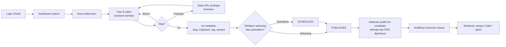
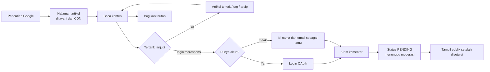

# PRD — Product Requirements Document
**Proyek:** Blog Pribadi (codename: `blogspot`)
**Versi:** 1.0 (Draft)
**Tanggal:** 2026-10-03
**Dokumen hulu:** [BRD.md](./BRD.md)
**Status:** Draft — menunggu review

---

## 1. Visi Produk

> Sebuah rumah tulisan milik sendiri: **secepat situs statis, senyaman menulis di aplikasi catatan**, dan sepenuhnya di bawah kendali penulisnya.

**Positioning statement**

> Untuk **penulis perorangan** yang ingin memublikasikan tulisan secara rutin,
> `blogspot` adalah **platform blog pribadi self-hosted**
> yang **menyatukan kemudahan menulis berbasis web dengan kepemilikan data penuh dan performa kelas situs statis**.
> Tidak seperti **Medium/Substack** (menyandera audiens dan menyisipkan konten pihak lain) maupun **static site generator berbasis repo** (mengharuskan terminal dan commit untuk setiap tulisan),
> produk ini **memungkinkan menulis dan memoderasi dari browser mana pun, sambil tetap menyajikan halaman publik secara statis dan gratis.**

---

## 2. Persona

### 2.1 Persona Primer — "Owner / Penulis" (Rey)

| Aspek | Keterangan |
|---|---|
| **Konteks** | Praktisi teknologi yang menulis catatan teknis dan esai pendek di sela pekerjaan |
| **Perangkat** | Laptop (utama), ponsel (koreksi cepat & moderasi) |
| **Goal** | Menerbitkan tulisan secara rutin tanpa ritual teknis; punya arsip yang rapi dan dapat ditemukan |
| **Frustrasi** | Harus `git commit` dan deploy untuk memperbaiki satu typo; kehilangan draf karena tab tertutup; spam komentar; tampilan blog seragam dengan ribuan blog lain |
| **Keberhasilan terlihat ketika** | Ia membuka editor, menulis, menekan "Terbitkan", dan artikel langsung tayang dengan tampilan rapi serta terindeks Google |
| **Tujuan bisnis terkait** | BR-01, BR-02, BR-06, BR-07 |

### 2.2 Persona Sekunder — "Pembaca" (Dina)

| Aspek | Keterangan |
|---|---|
| **Konteks** | Menemukan artikel dari hasil pencarian Google atau tautan yang dibagikan di media sosial |
| **Perangkat** | Ponsel (dominan), jaringan seluler yang kadang lambat |
| **Goal** | Mendapat jawaban atas pertanyaannya dengan cepat; bila tulisan bagus, menelusuri artikel lain |
| **Frustrasi** | Halaman lambat, layout bergeser saat dimuat, pop-up, teks terlalu kecil, mode gelap tidak didukung |
| **Keberhasilan terlihat ketika** | Halaman terbuka < 2 detik, isi langsung terbaca, dan ia menemukan 1–2 artikel lanjutan yang relevan |
| **Tujuan bisnis terkait** | BR-04, BR-05, BR-06 |

---

## 3. Problem Statement

| Persona | Pernyataan masalah |
|---|---|
| Owner | *"Saya kehilangan momentum menulis karena setiap publikasi menuntut ritual teknis, dan saya tidak percaya platform pihak ketiga akan menjaga tulisan saya."* |
| Pembaca | *"Saya hanya ingin membaca jawabannya — bukan menunggu halaman berat memuat iklan dan rekomendasi yang tidak saya minta."* |

---

## 4. User Journey

### 4.1 Alur Owner — dari ide ke terbit

### 4.2 Alur Pembaca — dari pencarian ke diskusi

---

## 5. Epic & User Story

**Format prioritas (MoSCoW):** `M` = Must (wajib di MVP) · `S` = Should (v1 bila waktu memungkinkan) · `C` = Could (v1.1) · `W` = Won't (di luar lingkup).

---

### EP-01 — Autentikasi & Akun
> Memenuhi **BR-07** (keamanan) dan **BR-08** (fondasi dapat dikembangkan).

| ID | User Story | Prioritas |
|---|---|---|
| **US-001** | Sebagai **owner**, saya ingin masuk menggunakan akun OAuth saya, agar saya tidak perlu mengingat atau menyimpan kata sandi. | **M** |
| **US-002** | Sebagai **owner**, saya ingin seluruh area `/admin` tertutup bagi siapa pun selain saya, agar konten dan pengaturan tidak bisa diubah pihak lain. | **M** |
| **US-003** | Sebagai **owner**, saya ingin akun owner ditetapkan sekali saat penyiapan awal, agar tidak ada orang lain yang bisa mendaftar lalu memperoleh hak administratif. | **M** |
| **US-004** | Sebagai **owner**, saya ingin bisa keluar dari sesi, agar aman ketika memakai perangkat bersama. | **M** |
| **US-005** | Sebagai **pembaca**, saya ingin bisa membuat akun lewat OAuth, agar identitas saya konsisten saat berkomentar dan saya tidak perlu mengisi nama berulang kali. | **S** |
| **US-006** | Sebagai **owner**, saya ingin melihat catatan aktivitas administratif penting (terbit, hapus, perubahan moderasi), agar saya bisa menelusuri bila terjadi hal tak terduga. | **C** |

**Acceptance Criteria — US-002**
- **Given** pengunjung tidak memiliki sesi aktif, **when** ia membuka URL mana pun di bawah `/admin`, **then** ia dialihkan ke halaman login dan URL tujuan disimpan untuk pengalihan setelah berhasil masuk.
- **Given** pengguna memiliki sesi valid tetapi berperan `READER`, **when** ia membuka `/admin`, **then** sistem menampilkan halaman 403 dan **tidak** membocorkan keberadaan sumber daya di dalamnya.
- **Given** sesi owner sudah kedaluwarsa, **when** ia melakukan aksi tulis apa pun di `/admin`, **then** aksi ditolak dan ia diminta masuk ulang tanpa kehilangan isian yang sedang dikerjakan.

**Acceptance Criteria — US-003**
- **Given** daftar email owner telah dikonfigurasi, **when** seseorang masuk dengan email di luar daftar tersebut, **then** ia memperoleh peran `READER`, bukan `OWNER`.
- **Given** sudah ada akun ber-peran `OWNER`, **when** pengguna lain mencoba masuk dengan email owner yang sama lewat provider berbeda, **then** akun ditautkan ke pengguna yang sama, bukan membuat pengguna baru.

---

### EP-02 — Authoring & Editor Artikel
> Memenuhi **BR-01** (kepemilikan konten), **BR-02** (friksi menulis rendah), **BR-08**.

| ID | User Story | Prioritas |
|---|---|---|
| **US-010** | Sebagai **owner**, saya ingin membuat artikel baru dan langsung mulai mengetik, agar tidak ada formulir panjang yang menghambat di awal. | **M** |
| **US-011** | Sebagai **owner**, saya ingin tulisan saya tersimpan otomatis secara berkala, agar saya tidak kehilangan pekerjaan bila tab tertutup atau koneksi terputus. | **M** |
| **US-012** | Sebagai **owner**, saya ingin memformat tulisan (judul, tebal, miring, daftar, kutipan, tautan, blok kode) lewat toolbar maupun pintasan Markdown, agar menulis terasa cepat dan alami. | **M** |
| **US-013** | Sebagai **owner**, saya ingin menyisipkan gambar dengan menyeret berkas ke editor, agar tidak perlu alat unggah terpisah. | **M** |
| **US-014** | Sebagai **owner**, saya ingin menetapkan slug, ringkasan, tag, dan gambar sampul sebelum terbit, agar artikel tampil baik di hasil pencarian dan saat dibagikan. | **M** |
| **US-015** | Sebagai **owner**, saya ingin slug dibuat otomatis dari judul namun tetap bisa saya ubah selama belum terbit, agar URL rapi tanpa kerja ekstra. | **M** |
| **US-016** | Sebagai **owner**, saya ingin melihat pratinjau draf persis seperti tampilan publiknya lewat tautan rahasia, agar saya bisa memeriksa hasil akhir — bahkan dari ponsel. | **M** |
| **US-017** | Sebagai **owner**, saya ingin menerbitkan artikel sekarang atau menjadwalkannya di waktu tertentu, agar jadwal terbit tetap konsisten meski saya menulis di waktu luang. | **S** |
| **US-018** | Sebagai **owner**, saya ingin menyunting artikel yang sudah terbit dan perubahannya langsung tampak di situs publik, agar typo bisa diperbaiki dalam hitungan detik. | **M** |
| **US-019** | Sebagai **owner**, saya ingin mengarsipkan atau menghapus artikel dengan aman (dapat dipulihkan), agar kesalahan tidak bersifat permanen. | **M** |
| **US-020** | Sebagai **owner**, saya ingin melihat jumlah kata dan estimasi waktu baca saat menulis, agar saya bisa menjaga panjang tulisan. | **S** |
| **US-021** | Sebagai **owner**, saya ingin mengekspor seluruh artikel saya ke berkas Markdown, agar saya tidak pernah terkunci pada satu platform. | **S** |

**Acceptance Criteria — US-011 (autosave)**
- **Given** owner sedang mengetik di editor, **when** terjadi jeda 3 detik setelah perubahan terakhir, **then** draf tersimpan ke server dan indikator status berubah menjadi "Tersimpan HH:MM".
- **Given** penyimpanan otomatis gagal (jaringan terputus), **when** kegagalan terjadi, **then** indikator menampilkan peringatan jelas, isi tetap dipertahankan di peramban, dan percobaan ulang dilakukan otomatis saat koneksi pulih.
- **Given** owner menutup tab dengan perubahan belum tersimpan, **when** ia menutup, **then** peramban menampilkan konfirmasi sebelum meninggalkan halaman.

**Acceptance Criteria — US-016 (pratinjau draf)**
- **Given** sebuah artikel berstatus `DRAFT`, **when** owner membuka tautan pratinjau bertoken, **then** halaman dirender memakai tata letak publik yang sama persis dan ditandai jelas sebagai pratinjau.
- **Given** pihak lain memperoleh URL pratinjau **tanpa** token yang valid, **when** ia membukanya, **then** sistem merespons 404.
- **Given** halaman pratinjau diakses, **when** dirender, **then** halaman tidak di-cache dan tidak pernah muncul di sitemap, RSS, maupun hasil mesin pencari.

**Acceptance Criteria — US-018 (sunting artikel terbit)**
- **Given** artikel terbit disunting lalu disimpan, **when** penyimpanan berhasil, **then** halaman publik artikel dan daftar terkait menampilkan versi terbaru dalam ≤ 5 detik tanpa perlu deploy ulang.
- **Given** slug artikel terbit diubah, **when** perubahan disimpan, **then** slug lama tetap mengalihkan (301) ke slug baru secara permanen.

---

### EP-03 — Discovery, SEO & Performa
> Memenuhi **BR-03** (biaya minimal), **BR-04** (trafik organik), **BR-05** (pengalaman baca).

| ID | User Story | Prioritas |
|---|---|---|
| **US-030** | Sebagai **pembaca** yang datang dari Google, saya ingin cuplikan hasil pencarian menggambarkan isi artikel dengan tepat, agar saya tahu halaman ini relevan sebelum mengklik. | **M** |
| **US-031** | Sebagai **owner**, saya ingin setiap artikel otomatis punya gambar pratinjau sosial yang menarik, agar tautan yang dibagikan terlihat profesional tanpa saya mendesain apa pun. | **M** |
| **US-032** | Sebagai **mesin pencari**, saya ingin menemukan sitemap yang selalu mutakhir, agar artikel baru cepat terindeks. | **M** |
| **US-033** | Sebagai **mesin pencari**, saya ingin memperoleh data terstruktur artikel yang valid, agar halaman berpeluang tampil sebagai hasil kaya. | **M** |
| **US-034** | Sebagai **pembaca**, saya ingin berlangganan lewat pembaca RSS, agar tidak perlu bergantung pada algoritma media sosial. | **S** |
| **US-035** | Sebagai **pembaca di ponsel dengan koneksi lambat**, saya ingin konten utama tampil hampir seketika dan tata letak tidak bergeser, agar membaca tidak menyebalkan. | **M** |
| **US-036** | Sebagai **pembaca**, saya ingin gambar dimuat secara efisien dan tidak membuat halaman melompat, agar pengalaman menggulir tetap mulus. | **M** |
| **US-037** | Sebagai **owner**, saya ingin halaman publik disajikan tanpa mengakses basis data pada setiap permintaan, agar biaya tetap nol dan situs tetap hidup saat basis data sedang idle. | **M** |
| **US-038** | Sebagai **owner**, saya ingin memantau Core Web Vitals pengguna nyata, agar penurunan performa terdeteksi sebelum memengaruhi peringkat. | **S** |

**Acceptance Criteria — US-035 & US-037**
- **Given** halaman artikel yang sudah terbit, **when** diminta oleh pengunjung, **then** halaman dilayani dari cache CDN sebagai HTML yang sudah dirender, **tanpa** kueri basis data pada jalur permintaan tersebut.
- **Given** pengukuran lapangan (field data) selama 28 hari, **when** dievaluasi, **then** LCP < 2,5 s, INP < 200 ms, dan CLS < 0,1 pada ≥ 90% kunjungan.
- **Given** basis data sedang dalam kondisi suspend, **when** pengunjung membuka artikel yang sudah terbit, **then** halaman tetap tampil normal.

**Acceptance Criteria — US-032 (sitemap)**
- **Given** artikel baru diterbitkan, **when** `sitemap.xml` diakses sesudahnya, **then** URL artikel tersebut sudah tercantum beserta `lastmod` yang benar.
- **Given** artikel berstatus draf, terjadwal, terarsip, atau terhapus, **when** sitemap dibentuk, **then** URL tersebut **tidak** disertakan.

---

### EP-04 — Komentar & Interaksi
> Memenuhi **BR-06** (interaksi terkendali) dan **BR-07** (keamanan).

| ID | User Story | Prioritas |
|---|---|---|
| **US-040** | Sebagai **pembaca**, saya ingin meninggalkan komentar di artikel, agar bisa bertanya atau menanggapi. | **M** |
| **US-041** | Sebagai **pembaca**, saya ingin berkomentar sebagai tamu hanya dengan nama dan email, agar tidak dipaksa membuat akun. | **M** |
| **US-042** | Sebagai **pembaca**, saya ingin tahu bahwa komentar saya berhasil terkirim dan sedang menunggu moderasi, agar saya tidak mengirim ulang berkali-kali. | **M** |
| **US-043** | Sebagai **owner**, saya ingin semua komentar masuk ke antrian moderasi sebelum tampil, agar tidak ada spam yang pernah terlihat publik. | **M** |
| **US-044** | Sebagai **owner**, saya ingin menyetujui, menolak, menandai spam, atau menghapus komentar dari satu layar, agar moderasi selesai dalam hitungan menit. | **M** |
| **US-045** | Sebagai **owner**, saya ingin membalas komentar sebagai pemilik blog dengan penanda yang jelas, agar pembaca tahu itu jawaban resmi. | **S** |
| **US-046** | Sebagai **owner**, saya ingin bisa menutup komentar pada artikel tertentu, agar diskusi yang sudah tidak relevan bisa dihentikan. | **S** |
| **US-047** | Sebagai **owner**, saya ingin menerima pemberitahuan ketika ada komentar baru, agar antrian tidak menumpuk tanpa saya sadari. | **C** |

**Acceptance Criteria — US-043 (moderasi wajib)**
- **Given** komentar baru dikirim oleh siapa pun, **when** tersimpan, **then** statusnya `PENDING` dan **tidak** dirender di halaman publik.
- **Given** komentar berstatus `PENDING`, **when** owner menyetujuinya, **then** komentar tampil di halaman publik dalam ≤ 5 detik.
- **Given** komentar ditandai `SPAM` atau `REJECTED`, **when** halaman publik dirender, **then** komentar tidak pernah muncul dalam bentuk apa pun, termasuk pada jumlah komentar.

**Acceptance Criteria — US-040/US-041 (anti-penyalahgunaan)**
- **Given** satu pengirim, **when** ia mengirim lebih dari ambang yang ditetapkan dalam satu jendela waktu, **then** pengiriman berikutnya ditolak dengan pesan yang ramah.
- **Given** isian honeypot tersembunyi terisi, **when** formulir dikirim, **then** sistem menolak secara diam-diam tanpa menyimpan.
- **Given** komentar berisi HTML atau skrip, **when** dirender, **then** isi ditampilkan sebagai teks biasa dan tidak pernah dieksekusi.
- **Given** email pengomentar tamu disimpan, **when** halaman publik dirender, **then** email **tidak pernah** diekspos ke klien.

---

### EP-05 — Pengalaman Baca Publik
> Memenuhi **BR-04** dan **BR-05**.

| ID | User Story | Prioritas |
|---|---|---|
| **US-050** | Sebagai **pembaca**, saya ingin beranda menampilkan tulisan terbaru dengan jelas, agar langsung tahu blog ini tentang apa. | **M** |
| **US-051** | Sebagai **pembaca**, saya ingin halaman artikel yang nyaman dibaca — tipografi lapang, lebar baris terkendali — agar betah membaca panjang. | **M** |
| **US-052** | Sebagai **pembaca**, saya ingin menelusuri artikel berdasarkan tag, agar menemukan tulisan lain dengan topik serupa. | **M** |
| **US-053** | Sebagai **pembaca**, saya ingin melihat arsip seluruh tulisan dengan paginasi, agar bisa menjelajah tanpa gulir tak berujung. | **M** |
| **US-054** | Sebagai **pembaca**, saya ingin mencari artikel berdasarkan kata kunci, agar cepat menemukan topik tertentu. | **S** |
| **US-055** | Sebagai **pembaca**, saya ingin mode gelap yang mengikuti preferensi sistem saya, agar nyaman membaca malam hari. | **S** |
| **US-056** | Sebagai **pembaca** pengguna pembaca layar/keyboard, saya ingin seluruh situs dapat dinavigasi dan dibacakan dengan benar, agar konten benar-benar dapat diakses. | **M** |
| **US-057** | Sebagai **pembaca**, saya ingin melihat daftar isi pada artikel panjang, agar bisa melompat ke bagian yang saya butuhkan. | **C** |
| **US-058** | Sebagai **pembaca**, saya ingin menemukan halaman "Tentang" berisi identitas penulis, agar tahu siapa yang menulis. | **M** |

**Acceptance Criteria — US-056 (aksesibilitas)**
- **Given** halaman mana pun di situs publik, **when** diaudit, **then** memenuhi WCAG 2.1 level AA untuk kontras, urutan heading, label form, dan indikator fokus.
- **Given** pengguna hanya memakai keyboard, **when** ia menelusuri halaman, **then** seluruh elemen interaktif dapat dijangkau dengan urutan logis dan tautan "lewati ke konten" tersedia lebih dulu.
- **Given** gambar konten, **when** dirender, **then** setiap gambar memiliki teks alternatif; gambar dekoratif ditandai agar diabaikan pembaca layar.

---

## 6. Prioritas & Garis Batas MVP

| Prioritas | Jumlah story | Isi |
|---|---|---|
| **Must (MVP)** | **31** | US-001…004 · US-010…016, 018, 019 · US-030…033, 035…037 · US-040…044 · US-050…053, 056, 058 |
| **Should (v1 bila sempat)** | **10** | US-005, 017, 020, 021, 034, 038, 045, 046, 054, 055 |
| **Could (v1.1)** | **3** | US-006, 047, 057 |
| **Total** | **44** | — |

> **Garis batas MVP:** v1 dinyatakan siap rilis ketika **seluruh story Must** lulus acceptance criteria, Core Web Vitals memenuhi target BR-05, dan minimal 3 artikel nyata telah diterbitkan melalui alur produksi.

---

## 7. Metrik Produk

| Metrik | Definisi | Target v1 | Sumber data |
|---|---|---|---|
| Time-to-publish | Durasi dari membuka editor hingga artikel tayang (artikel 800 kata) | < 10 menit | Observasi owner |
| Frekuensi terbit | Artikel terbit per bulan | ≥ 2 | Basis data |
| Core Web Vitals (lapangan) | % kunjungan dengan LCP/INP/CLS "Good" | ≥ 90% | Vercel Speed Insights |
| Indeksasi | % artikel terbit yang terindeks dalam 7 hari | 100% | Google Search Console |
| Trafik organik | Kunjungan dari mesin pencari per bulan | ≥ 1.000 pada bulan ke-6 | Analytics |
| Kebersihan komentar | Jumlah spam yang lolos tampil publik | 0 | Audit manual |
| Latensi moderasi | Waktu rata-rata komentar `PENDING` → diputuskan | < 24 jam | Basis data |
| Kehilangan draf | Insiden kehilangan tulisan akibat gangguan | 0 | Laporan owner |
| Biaya infrastruktur | Pengeluaran bulanan di luar domain | USD 0 | Tagihan vendor |

---

## 8. Out of Scope (v1)

Mengikuti BRD §5.2: multi-tenant, multi-penulis, monetisasi, newsletter, i18n, aplikasi native, analitik kustom mendalam, impor otomatis, dan komentar bertingkat lebih dari satu level.

**Secara khusus tidak termasuk di v1 meskipun sering diasumsikan ada:**
- Suka/bookmark artikel oleh pembaca (hanya tombol bagikan yang tersedia)
- Versi/riwayat revisi artikel (hanya autosave draf; bukan riwayat lengkap)
- Unggah berkas non-gambar
- Pencarian lanjutan dengan pemeringkatan relevansi (v1 hanya pencocokan kata kunci sederhana)

---

## 9. Open Question

Lanjutan dari BRD §11, ditambah pertanyaan tingkat produk:

| ID | Pertanyaan | Dampak bila tertunda |
|---|---|---|
| OQ-1 | Nama merek & domain final | Memblokir konfigurasi SEO dan OG image |
| OQ-2 | Provider OAuth: GitHub, Google, atau keduanya | Memblokir US-001, US-005 |
| OQ-3 | Komentar tamu diizinkan atau wajib login | Mengubah cakupan US-041 secara signifikan |
| OQ-5 | Perlukah halaman kebijakan privasi di v1 | Terkait penyimpanan email pengomentar |
| **OQ-6** | Berapa lama komentar tetap terbuka setelah artikel terbit (selamanya / N hari)? | Memengaruhi BRULE pada FRD |
| **OQ-7** | Apakah pencarian (US-054) cukup berbasis kueri basis data sederhana, atau perlu full-text search? | Memengaruhi indeks basis data (TS-03) |

---

## 10. Rencana Rilis

| Tahap | Isi | Kriteria keluar |
|---|---|---|
| **Tahap 1 — Fondasi** | Scaffold aplikasi, skema data, autentikasi owner, deployment pertama | Owner dapat masuk ke `/admin` di lingkungan produksi |
| **Tahap 2 — Authoring** | Editor, draf & autosave, media, pratinjau, terbit | Satu artikel nyata dapat ditulis dan diterbitkan |
| **Tahap 3 — Publik & SEO** | Beranda, halaman artikel, tag, arsip, metadata, sitemap, RSS, OG image | Artikel terindeks dan lolos uji Core Web Vitals |
| **Tahap 4 — Komentar** | Formulir komentar, anti-spam, antrian moderasi | Komentar uji berhasil melewati seluruh alur moderasi |
| **Tahap 5 — Pengerasan** | Aksesibilitas, keamanan, uji otomatis, backup teruji, uji restore | Seluruh story Must lulus; v1 dirilis |

---

## Riwayat Revisi

| Versi | Tanggal | Perubahan |
|---|---|---|
| 1.0 | 2026-10-03 | Draft awal |
