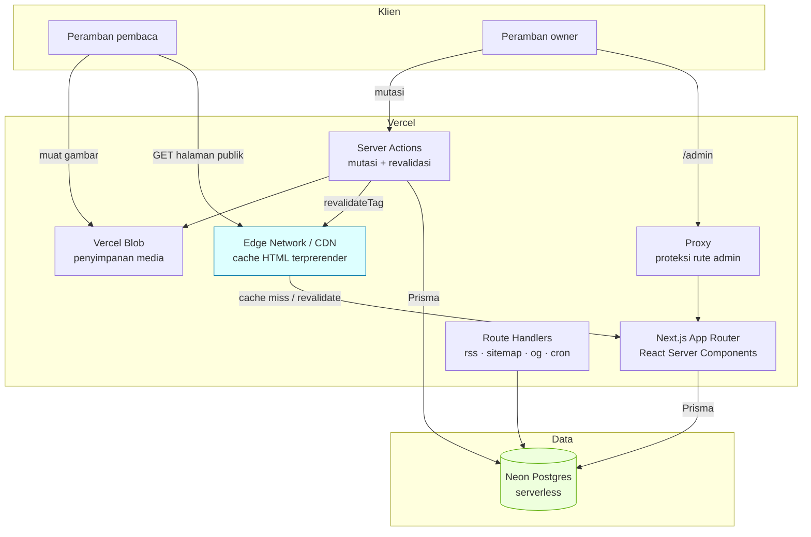
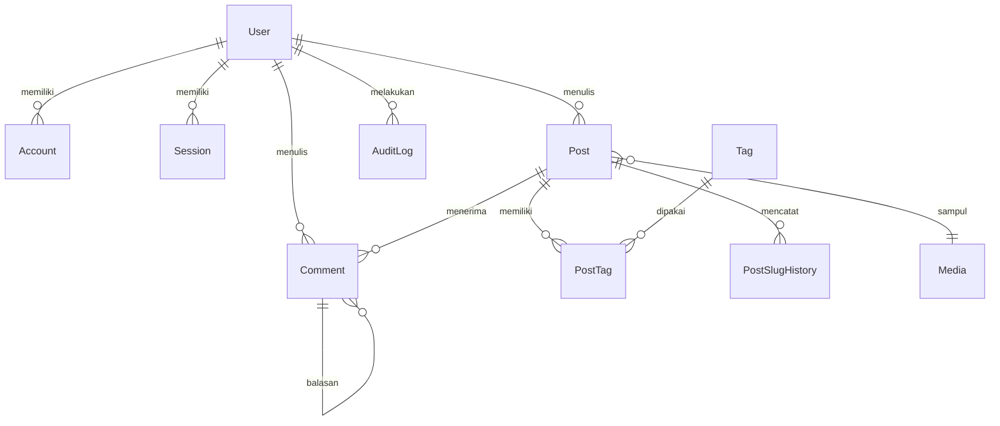
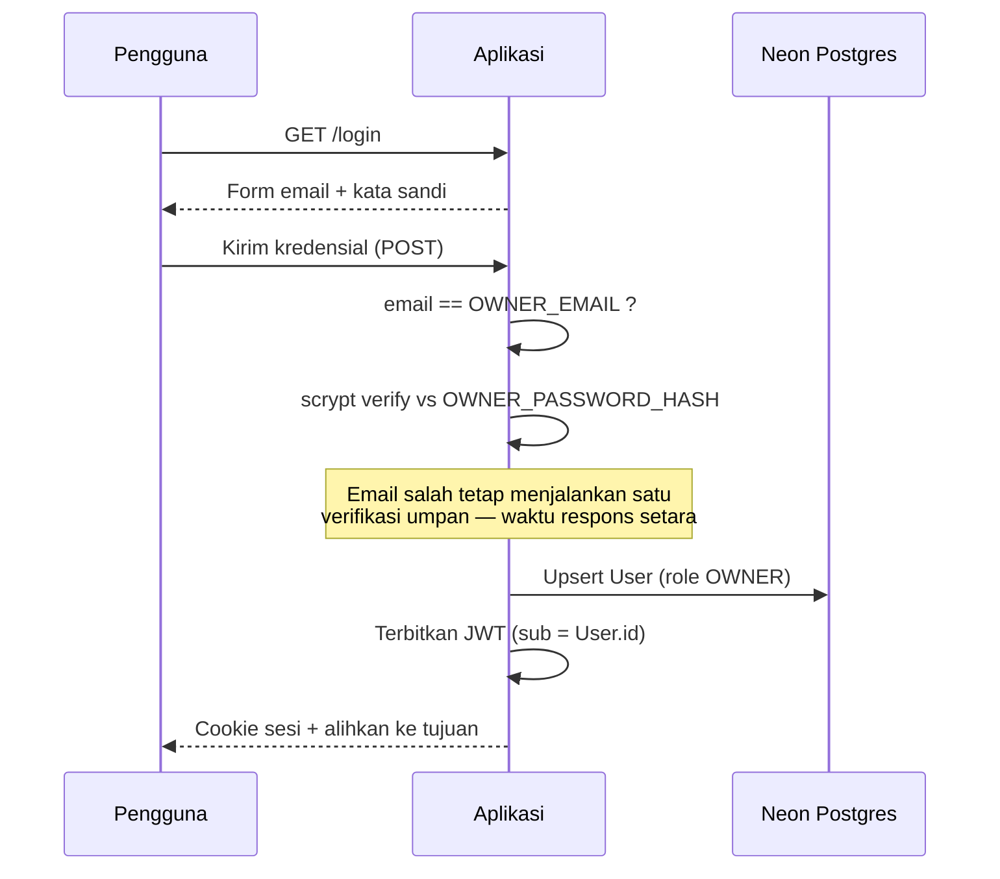

# TRD — Technical Requirements Document
**Proyek:** Blog Pribadi (codename: `blogspot`)
**Versi:** 1.0 (Draft)
**Tanggal:** 2026-10-03
**Repositori:** `https://github.com/reyfuu/blogspot.git`
**Dokumen hulu:** [BRD.md](./BRD.md) · [PRD.md](./PRD.md) · [FRD.md](./FRD.md)
**Status:** Draft — menunggu review

> **Catatan versi:** batas kuota vendor dalam dokumen ini adalah acuan perencanaan per Oktober 2026 dan wajib dikonfirmasi ke halaman resmi. Versi paket di bawah adalah **versi yang benar-benar terpasang dan terverifikasi build**, bukan perkiraan.

### Versi terpasang (terverifikasi 2026-10-03)

| Paket | Versi | Catatan |
|---|---|---|
| `next` | **16.3.8** | Bukan 15 seperti rencana awal |
| `react` / `react-dom` | 19.3.0 | |
| `prisma` / `@prisma/client` | **7.10.0 (dipin eksak)** | ⚠ Tag `latest` menunjuk **`8.0.0-rc.19` (release candidate)** sementara client stabil di 7.10.0. `pnpm add -D prisma` polos akan menarik RC dan memecah versi CLI vs client |
| `@prisma/adapter-neon` | 7.10.0 | Wajib — Prisma 7 tidak lagi membaca URL dari schema |
| `next-auth` | **5.0.0-beta.32 (dipin eksak)** | Auth.js v5 ada di tag `beta`; tag `latest` = v4 (API era Pages Router, tidak cocok App Router). Rilis beta kerap breaking → pin eksak |
| `tailwindcss` | 4.3.3 | Konfigurasi **CSS-first** (`@import`/`@theme`); tidak ada `tailwind.config.js` |
| `zod` | 4.6.5 | API v4 |
| `@tiptap/*` | 3.31.4 | + `tiptap-markdown` 0.9.0 |
| `shiki` / `@shikijs/rehype` | 4.5.0 | Pewarnaan saat render server |
| `vitest` | 5.0.3 | |

**Dependensi yang dihapus:** `next-themes` — diganti skrip inline ±10 baris (`src/components/theme-script.tsx`). Pustaka tidak sepadan untuk perilaku sekecil ini.

**Runtime:** Node v26.8.2. Prisma CLI memperingatkan versi Node di luar daftar dukungannya (20.19+/22.12+/24.0+) namun berjalan normal — migrasi dan generate terverifikasi.

---

## TS-01 · Arsitektur Sistem

### 1.1 Prinsip arsitektur

Empat prinsip ini menurunkan langsung dari batasan bisnis dan menjadi dasar seluruh keputusan teknis berikutnya.

| # | Prinsip | Diturunkan dari | Konsekuensi teknis |
|---|---|---|---|
| **P1** | **Static-first.** Jalur baca publik tidak menyentuh basis data. | BR-03, BR-05, C-3, C-4, BRULE-26 | Halaman publik di-prerender dan di-cache di tepi; basis data hanya disentuh saat penulisan dan saat regenerasi halaman |
| **P2** | **Konten portabel.** Markdown teks biasa sebagai sumber kebenaran, Postgres standar sebagai penyimpan. | BR-01, R-4, BRULE-15 | Tidak ada format biner milik editor; tidak ada ekstensi basis data eksklusif vendor |
| **P3** | **Aman secara bawaan.** Otorisasi dan sanitasi dijalankan di server pada setiap aksi. | BR-07, R-7, R-8 | Tidak ada kepercayaan pada validasi sisi klien; sanitasi saat render |
| **P4** | **Sederhana sepadan kapasitas.** Satu orang harus mampu merawatnya. | C-1, R-5 | Satu kerangka kerja, satu basis data, dependensi seminimal mungkin |

### 1.2 Diagram arsitektur



**Pembacaan alur yang penting (P1):** panah `BR → CDN` adalah jalur mayoritas permintaan, dan **tidak berlanjut ke Neon**. Basis data hanya tersentuh pada cache miss/revalidasi dan pada operasi tulis oleh owner. Inilah yang membuat BR-03 (biaya nol) dan mitigasi R-2 (cold start) bekerja.

### 1.3 Pemetaan runtime per rute

| Rute | Strategi render | Runtime | Menyentuh DB? |
|---|---|---|---|
| `/`, `/post/{slug}`, `/tag/{tag}`, `/archive`, `/about` | Static + ISR, revalidasi berbasis tag | Node.js | Hanya saat regenerasi |
| `/search` | Dinamis | Node.js | Ya |
| `/preview/{id}` | Dinamis, `no-store` | Node.js | Ya |
| `/admin/**` | Dinamis, `no-store` | Node.js | Ya |
| `/rss.xml`, `/sitemap.xml` | Static + revalidasi berbasis tag | Node.js | Hanya saat regenerasi |
| `/robots.txt` | Static | — | Tidak |
| `/post/{slug}/opengraph-image` | Static per artikel | Edge | Hanya saat regenerasi |
| `/api/cron/publish` | Dinamis, terproteksi | Node.js | Ya |

> **Keputusan:** seluruh rute yang memakai Prisma berjalan di runtime **Node.js**. Hanya pembuatan gambar OG yang berjalan di Edge, karena tidak butuh akses basis data.

---

## TS-02 · Tech Stack & Justifikasi

| Lapisan | Pilihan | Alasan | Alternatif yang ditolak |
|---|---|---|---|
| Kerangka kerja | **Next.js 16 (App Router)** + React 19 + TypeScript `strict` | RSC memungkinkan static-first (P1) sekaligus dashboard dinamis dalam satu basis kode; integrasi Vercel paling matang | *Astro*: sangat baik untuk konten, tetapi dashboard admin interaktif jadi kerja ekstra · *Remix*: tidak punya padanan ISR berbasis tag sekelas ini |
| Basis data | **Neon Postgres (serverless)** | Postgres standar → portabel (P2); tier gratis; **branching** memberi basis data terisolasi per preview deployment | *Vercel Postgres*: lock-in lebih erat · *SQLite/Turso*: alur migrasi kurang mapan untuk kebutuhan ini · *MongoDB*: relasi artikel–tag–komentar justru lebih alami di SQL |
| ORM | **Prisma** + adapter driver Neon | Skema deklaratif, migrasi berversi, keamanan tipe; adapter Neon memakai koneksi HTTP/WebSocket yang cocok untuk serverless | *Drizzle*: lebih ringan, tetapi Prisma lebih mudah dirawat satu orang (P4) · *SQL mentah*: tidak ada keamanan tipe maupun migrasi |
| Autentikasi | **Auth.js (NextAuth) v5**, provider Credentials, sesi JWT | Satu akun owner, tanpa ketergantungan pada penyedia pihak ketiga; penanganan cookie dan CSRF tetap ditangani pustaka yang teruji | *OAuth*: butuh OAuth App per domain, berlebihan untuk satu penulis · *Clerk/Auth0*: berbayar, melanggar C-2 · *Sesi buatan sendiri*: risiko keamanan tidak sepadan |
| Editor | **Tiptap**, keluaran **Markdown** | Pengalaman rich text yang nyaman namun tetap menyimpan Markdown (P2, BRULE-15) | *Textarea Markdown polos*: friksi tinggi, melanggar BR-02 · *Editor berbasis HTML*: mengunci format, melanggar P2 |
| Render konten | Pipeline **MDX / remark + rehype** di sisi server | Pewarnaan sintaks dan sanitasi dilakukan saat build/regenerasi, bukan di peramban (BRULE-16) | *Highlight.js di klien*: menambah bundel, melanggar BR-05 |
| Penyimpanan media | **Vercel Blob** | Terintegrasi, ada tier gratis; diakses lewat lapisan abstraksi tipis agar dapat diganti (mitigasi R-4) | *Cloudinary*: fitur berlebih untuk kebutuhan ini · *S3*: menambah vendor dan konfigurasi |
| Gaya tampilan | **Tailwind CSS** + komponen headless | Tidak ada CSS runtime; bundel kecil; mudah menjaga konsistensi | *CSS-in-JS runtime*: biaya runtime bertentangan dengan BR-05 |
| Validasi | **Zod** | Satu skema dipakai bersama oleh klien dan server; tipe diturunkan otomatis | Validasi manual: rawan tidak konsisten |
| Pembatasan laju | **Upstash Redis** (opsional) atau tabel Postgres | Dibutuhkan FR-072; mulai dari Postgres untuk menekan jumlah vendor | — |
| Observability | **Vercel Analytics + Speed Insights** | Data Core Web Vitals lapangan untuk BR-05 tanpa biaya | Google Analytics: beban skrip + konsekuensi privasi |
| Tema terang/gelap | **Skrip inline ±10 baris** | Menerapkan tema sebelum paint pertama tanpa menambah dependensi klien | *next-themes*: dipakai lalu **dihapus** — menambah bundel untuk perilaku yang hanya butuh belasan baris |
| Pengujian | **Vitest** (unit/integrasi) + **Playwright** (E2E) | Standar ekosistem; Playwright juga dipakai untuk audit aksesibilitas | — |

> Memenuhi: **TS-02 → FR-005, FR-020, FR-035**

---

## TS-03 · Model Data

### 3.1 Diagram entitas



### 3.2 Skema Prisma

```prisma
// ---------- Enumerasi ----------
enum Role          { OWNER READER }
enum PostStatus    { DRAFT SCHEDULED PUBLISHED ARCHIVED TRASHED }
enum CommentStatus { PENDING APPROVED REJECTED SPAM }

// ---------- Pengguna & autentikasi (kontrak Auth.js) ----------
model User {
  id            String    @id @default(cuid())
  name          String?
  email         String    @unique
  emailVerified DateTime?
  image         String?
  role          Role      @default(READER)   // FR-005, BRULE-01
  bio           String?
  createdAt     DateTime  @default(now())

  accounts  Account[]
  sessions  Session[]
  posts     Post[]
  comments  Comment[]
  auditLogs AuditLog[]

  @@index([role])
}

model Account {
  id                String  @id @default(cuid())
  userId            String
  type              String
  provider          String
  providerAccountId String
  refresh_token     String?
  access_token      String?
  expires_at        Int?
  token_type        String?
  scope             String?
  id_token          String?
  session_state     String?

  user User @relation(fields: [userId], references: [id], onDelete: Cascade)

  @@unique([provider, providerAccountId])   // BRULE-03: akun ditautkan, bukan diduplikasi
  @@index([userId])
}

model Session {
  id           String   @id @default(cuid())
  sessionToken String   @unique
  userId       String
  expires      DateTime

  user User @relation(fields: [userId], references: [id], onDelete: Cascade)

  @@index([userId])
}

model VerificationToken {
  identifier String
  token      String   @unique
  expires    DateTime

  @@unique([identifier, token])
}

// ---------- Konten ----------
model Post {
  id          String     @id @default(cuid())
  slug        String     @unique                  // FR-023
  title       String
  excerpt     String?                             // FR-022
  content     String                              // Markdown — FR-035, BRULE-15
  status      PostStatus @default(DRAFT)          // FRD §5.1
  publishedAt DateTime?                           // BRULE-11: tidak berubah saat disunting
  scheduledAt DateTime?                           // FR-025
  trashedAt   DateTime?                           // BRULE-05: retensi 30 hari
  previewToken String    @unique @default(cuid()) // FR-029, BRULE-14
  readingTime Int        @default(1)              // FR-034
  wordCount   Int        @default(0)
  commentsClosed Boolean @default(false)          // FR-076

  authorId    String                              // BRULE-06: siap multi-penulis di v2
  author      User       @relation(fields: [authorId], references: [id])
  coverId     String?
  cover       Media?     @relation("PostCover", fields: [coverId], references: [id])

  tags        PostTag[]
  comments    Comment[]
  slugHistory PostSlugHistory[]

  createdAt   DateTime   @default(now())
  updatedAt   DateTime   @updatedAt

  // Indeks untuk kueri daftar publik: WHERE status='PUBLISHED' ORDER BY publishedAt DESC
  @@index([status, publishedAt(sort: Desc)])
  @@index([authorId])
  @@index([trashedAt])
}

model PostSlugHistory {
  id        String   @id @default(cuid())
  slug      String   @unique                       // BRULE-12: dipesan permanen
  postId    String
  post      Post     @relation(fields: [postId], references: [id], onDelete: Cascade)
  createdAt DateTime @default(now())

  @@index([postId])
}

model Tag {
  id      String     @id @default(cuid())
  slug    String     @unique   // BRULE-36: immutable setelah dibuat
  name    String
  posts   PostTag[]
  aliases TagAlias[]
}

/// Slug tag lama yang masih harus dilayani sebagai pengalihan permanen.
/// Dibuat saat dua tag digabungkan (FR-084) — tanpa ini, merge diam-diam
/// mematikan URL /tag/<slug> yang sudah terindeks (BR-04).
model TagAlias {
  slug      String   @id       // BRULE-36: dipesan permanen
  tagId     String
  tag       Tag      @relation(fields: [tagId], references: [id], onDelete: Cascade)
  createdAt DateTime @default(now())

  @@index([tagId])
}

model PostTag {
  postId String
  tagId  String
  post   Post @relation(fields: [postId], references: [id], onDelete: Cascade)
  tag    Tag  @relation(fields: [tagId],  references: [id], onDelete: Cascade)

  @@id([postId, tagId])
  @@index([tagId])
}

model Media {
  id        String   @id @default(cuid())
  url       String   @unique      // nama acak — BRULE-20
  pathname  String
  alt       String?               // BRULE-17
  mimeType  String
  size      Int
  width     Int?
  height    Int?
  createdAt DateTime @default(now())

  coverFor  Post[]   @relation("PostCover")
}

// ---------- Komentar ----------
model Comment {
  id        String        @id @default(cuid())
  postId    String
  post      Post          @relation(fields: [postId], references: [id], onDelete: Cascade)

  body      String                              // disimpan & dirender sebagai teks biasa
  status    CommentStatus @default(PENDING)     // BRULE-28, BRULE-31

  authorId    String?                           // pembaca terdaftar — FR-070
  author      User?       @relation(fields: [authorId], references: [id], onDelete: SetNull)
  guestName   String?                           // tamu — FR-071
  guestEmail  String?                           // BRULE-30: tidak pernah dikirim ke klien
  guestEmailHash String?                        // untuk deteksi laju tanpa memapar email

  parentId  String?                             // balasan 1 tingkat — FR-075
  parent    Comment?      @relation("Replies", fields: [parentId], references: [id], onDelete: Cascade)
  replies   Comment[]     @relation("Replies")

  ipHash    String?                             // FR-072, tidak menyimpan IP mentah
  userAgent String?
  createdAt DateTime      @default(now())

  @@index([postId, status, createdAt])
  @@index([status, createdAt])                  // antrian moderasi — FR-073
}

// ---------- Operasional ----------
model Setting {
  key       String   @id                        // FR-083
  value     Json
  updatedAt DateTime @updatedAt
}

model AuditLog {
  id        String   @id @default(cuid())       // FR-082, BRULE-35: hanya-tambah
  actorId   String?
  actor     User?    @relation(fields: [actorId], references: [id], onDelete: SetNull)
  action    String
  entity    String
  entityId  String?
  metadata  Json?
  createdAt DateTime @default(now())

  @@index([createdAt(sort: Desc)])
  @@index([entity, entityId])
}
```

### 3.3 Catatan keputusan skema

| Keputusan | Alasan |
|---|---|
| `guestEmail` + `guestEmailHash` terpisah | Hash dipakai untuk pembatasan laju dan deteksi pengirim berulang **tanpa** memapar email (BRULE-30) |
| `ipHash`, bukan IP mentah | Meminimalkan data pribadi tersimpan (C-5) sambil tetap memenuhi FR-072 |
| `PostSlugHistory` sebagai tabel tersendiri dengan `slug @unique` | Menegakkan BRULE-12 di tingkat basis data, bukan sekadar di kode aplikasi |
| Indeks komposit `[status, publishedAt desc]` | Kueri paling panas (daftar publik) dilayani sepenuhnya dari indeks |
| `role` sebagai enum, bukan boolean | Memenuhi BR-08: menambah `AUTHOR`/`EDITOR` di v2 hanya perlu memperluas enum |
| `TRASHED` sebagai status, bukan baris terhapus | BRULE-05; pemulihan tidak butuh backup |
| `TagAlias.slug` sebagai primary key | Menegakkan BRULE-36 di tingkat basis data: satu slug tidak mungkin menunjuk dua tag |
| Prisma 7: URL koneksi di luar schema | Breaking change v7 — `url`/`directUrl` ditolak di `schema.prisma`. Migrasi membaca `DIRECT_URL` dari `prisma.config.ts`; runtime wajib memakai driver adapter pada konstruktor `PrismaClient` |

> Memenuhi: **TS-03 → FR-005, FR-020, FR-023, FR-027, FR-035, FR-071, FR-082**

---

## TS-04 · Kontrak Antarmuka

### 4.1 Prinsip

- **Server Action** untuk seluruh mutasi yang dipicu owner — memanfaatkan perlindungan CSRF bawaan dan menghindari lapisan API tanpa manfaat.
- **Route Handler** hanya untuk hal yang perlu berupa URL: feed, sitemap, OG image, callback auth, unggah, dan cron.
- Setiap entry point memvalidasi input dengan **skema Zod** dan memeriksa otorisasi di server **sebelum** efek samping apa pun.

### 4.2 Server Actions

| Action | Input (Zod) | Otorisasi | Efek | Revalidasi | Error |
|---|---|---|---|---|---|
| `createPost` | — | OWNER | Buat `DRAFT` | — | `E-AUTH-04` |
| `autosavePost` | `{ id, title?, content? }` | OWNER | Simpan draf | — | `E-POST-05` |
| `updatePostMeta` | `{ id, title, excerpt?, slug, tagNames[], coverId? }` | OWNER | Simpan metadata; catat riwayat slug bila perlu | tag artikel | `E-POST-01…04,06` |
| `publishPost` | `{ id, mode: 'now'\|'schedule', scheduledAt? }` | OWNER | Transisi status | `post:{slug}`, `posts:list`, `feed`, `sitemap` | `E-POST-01,07` |
| `unpublishPost` | `{ id }` | OWNER | → `DRAFT` | idem | — |
| `archivePost` | `{ id }` | OWNER | → `ARCHIVED` | idem | — |
| `trashPost` | `{ id }` | OWNER | → `TRASHED` | idem | — |
| `restorePost` | `{ id }` | OWNER | → `DRAFT` | idem | `E-POST-04` |
| `rotatePreviewToken` | `{ id }` | OWNER | Buat token baru | — | — |
| `deleteMedia` | `{ id }` | OWNER | Hapus objek + baris | — | — |
| `submitComment` | `{ postId, body, parentId?, guestName?, guestEmail?, hp, renderedAt }` | GUEST/READER | Buat `PENDING` | — | `E-CMT-01…05` |
| `moderateComment` | `{ ids[], action }` | OWNER | Transisi status | `post:{slug}` | `E-CMT-06` |
| `updateSettings` | skema per kelompok | OWNER | Simpan pengaturan | `posts:list`, `feed` | — |
| `renameTag` | `{ id, name }` | OWNER | Ubah label tag (slug tidak berubah) | `tag:{slug}`, `posts:list` | `E-POST-06` |
| `mergeTags` | `{ fromId, intoId }` | OWNER | Gabungkan tag + buat alias 308 | `tag:{dua slug}`, `posts:list`, `sitemap`, `feed` | `E-SYS-01` |
| `deleteTag` | `{ id }` | OWNER | Hapus tag yatim saja | `tag:{slug}`, `posts:list` | `E-SYS-01` |

### 4.3 Route Handlers

| Rute | Metode | Otorisasi | Keluaran |
|---|---|---|---|
| `/api/auth/[...nextauth]` | GET/POST | publik | Alur masuk/keluar Auth.js |
| `/api/upload` | POST | OWNER | Unggah media → `{ id, url, width, height }` · `E-MEDIA-01…03` |
| `/api/cron/publish` | GET | rahasia cron | Promosi `SCHEDULED → PUBLISHED` (FR-025) |
| `/api/export` | GET | OWNER | Arsip Markdown (FR-036) |
| `/rss.xml` | GET | publik | Feed RSS (FR-064) |
| `/sitemap.xml` | GET | publik | Sitemap (FR-062) |
| `/robots.txt` | GET | publik | robots (FR-063) |
| `/post/[slug]/opengraph-image` | GET | publik | PNG 1200×630 (FR-061) |

### 4.4 Kode status HTTP untuk rute publik

> **Dua koreksi terhadap rencana awal, berdasarkan perilaku Next.js 16 yang terukur:**
> - `permanentRedirect()` mengirim **308 Permanent Redirect**, bukan 301. Keduanya permanen dan diperlakukan setara oleh mesin pencari; 308 juga mempertahankan metode HTTP. Tidak ada upaya memaksa 301.
> - **410 tidak dapat dikirim** dari page component (lihat deviasi BRULE-13 di FRD).

| Situasi | Status | Sumber |
|---|---|---|
| Artikel terbit ditemukan | 200 | FR-051 |
| Slug historis (artikel & tag) | **308** → slug aktif | FR-027, BRULE-12, BRULE-36 |
| Artikel terarsip | **200** + `noindex` (lihat deviasi BRULE-13) | BRULE-13 |
| Slug tidak dikenal / draf tanpa token | **404** | FR-029, FR-051 |
| Halaman paginasi di luar rentang | **404** | BRULE-24 |

> Memenuhi: **TS-04 → FR-020…029, FR-036, FR-040, FR-070…074, FR-083**

---

## TS-05 · Autentikasi & Otorisasi

### 5.1 Alur masuk



### 5.2 Penegakan otorisasi — tiga lapis

| Lapis | Mekanisme | Melindungi | Catatan |
|---|---|---|---|
| 1 | **Middleware** pada `/admin/*` | Navigasi halaman | Cepat, tetapi **bukan** satu-satunya pertahanan |
| 2 | **Pemeriksaan di layout `/admin`** (server) | Render server component | Memastikan data tidak pernah diambil untuk non-owner |
| 3 | **Pemeriksaan di setiap Server Action / Route Handler** | Seluruh mutasi | **Lapisan yang menentukan** — proxy dapat dilewati oleh permintaan langsung |

> **Aturan implementasi:** setiap Server Action yang bermutasi **wajib** diawali pemeriksaan sesi + peran. Tidak ada pengecualian, bahkan untuk aksi yang tampaknya tidak berbahaya. Ini penegakan P3 dan BR-07.

### 5.3 Kebijakan sesi

| Parameter | Owner | Sumber |
|---|---|---|
| Strategi | **JWT** dalam cookie terenkripsi | — |
| Masa berlaku | 7 hari | BRULE-02 |
| Cookie | `httpOnly`, `secure`, `sameSite=lax` | — |
| Pencabutan | Hapus cookie (keluar), **atau** ubah `AUTH_SECRET` untuk mematikan seluruh sesi sekaligus | FR-004 |

> **Mengapa JWT, bukan sesi basis data seperti rencana awal.** Provider Credentials Auth.js tidak mendukung strategi `database` — ini batasan pustaka, bukan pilihan. Konsekuensinya: sesi tidak bisa dicabut satu per satu dari basis data. Untuk satu akun owner, mengganti `AUTH_SECRET` sudah setara dengan mencabut semuanya. Kolom peran tetap dihitung ulang dari `OWNER_EMAIL` pada tiap permintaan, sehingga mencabut akses tidak perlu menunggu token kedaluwarsa.

> Tabel `Account`, `Session`, dan `VerificationToken` menjadi tidak terpakai namun **sengaja dipertahankan** — menghapusnya adalah migrasi destruktif tanpa manfaat, dan tabel itu dibutuhkan lagi bila kelak OAuth dipasang.

### 5.4 Penetapan owner

Blog ini single-author: **satu** email owner dibaca dari `OWNER_EMAIL`, dan kata sandinya diverifikasi terhadap `OWNER_PASSWORD_HASH`. Bila salah satunya — atau `AUTH_SECRET` — kosong di produksi, aplikasi **memperingatkan** di log dengan menyebut variabel mana yang kosong (`E-CFG-01`), tetapi tidak menolak start: nilai-nilai ini hanya dibutuhkan untuk *masuk*, bukan untuk membangun atau menyajikan situs. Jalur anggunnya sudah ada — `isAuthConfigured` bernilai false membuat `getSessionUser()` menjawab anonim tanpa menyentuh Auth.js, `/login` menampilkan penjelasan, dan `/admin` tetap tertutup. Tidak ada halaman pendaftaran sama sekali, sehingga BRULE-01 dijaga oleh konstruksi, bukan oleh pemeriksaan.

**Hash kata sandi.** `scrypt` dari pustaka standar Node (`N=32768, r=8, p=1`, garam 16 bait, kunci 32 bait), bukan bcrypt/argon2 — keduanya modul native yang perlu dikompilasi saat build. String tersimpan memuat parameternya sendiri (`scrypt$N$r$p$garam$hash`) agar biaya dapat dinaikkan tanpa mematahkan hash lama. Perbandingan memakai `timingSafeEqual`.

**Pembaca tidak punya akun.** Peran `READER` masih ada di skema untuk kesiapan v2, tetapi tidak ada jalur yang menghasilkannya — pembaca berkomentar sebagai tamu (FR-070).

> **Batas yang diketahui:** belum ada pembatasan laju pada percobaan masuk. Yang menahan tebak-sandi hanyalah biaya scrypt (~100 ms per percobaan) dan syarat panjang kata sandi minimal 12 karakter saat hash dibuat. Bila blog ini kelak menjadi sasaran bernilai, tambahkan pembatasan laju berbasis Postgres seperti pada komentar (FR-072).

> Memenuhi: **TS-05 → FR-001…005**

---

## TS-06 · Pemrosesan & Render Konten

### 6.1 Pipeline render Markdown (sisi server)

```
Markdown tersimpan
  → parse (remark)
  → GFM: tabel, daftar tugas, coret
  → heading: tambahkan id + tautan anchor; H1 di isi diturunkan jadi H2 (FR-030)
  → blok kode: pewarnaan sintaks saat render (BRULE-16)
  → gambar: ganti jadi komponen gambar teroptimasi, dimensi wajib (FR-043)
  → ubah ke HTML (rehype)
  → SANITASI dengan daftar elemen & atribut yang diizinkan (BRULE-18)
  → HTML siap tampil
```

> **Catatan sanitasi (dipelajari saat implementasi):** `id` sengaja **dikeluarkan** dari daftar *clobber* hast-util-sanitize. Prefix bawaan `user-content-` hanya diterapkan pada atribut `id`, **tidak** pada `href` yang dihasilkan rehype-autolink-headings — akibatnya seluruh tautan anchor heading rusak (`href="#judul"` menunjuk elemen ber-id `user-content-judul`). Id heading berasal dari judul milik owner dan sudah dislugifikasi ke `[a-z0-9-]`, sehingga risiko DOM clobbering dapat diabaikan, sementara tautan rusak merugikan nyata.
>
> Sanitasi juga membuang atribut `class`. Karena itu penataan blok kode dan anchor heading menargetkan **struktur dan variabel inline** (`pre[style*='--shiki-light']`, `.prose :is(h2,h3,h4) > a`), bukan kelas — melonggarkan sanitasi demi styling adalah pertukaran yang salah.

**Daftar elemen yang diizinkan:** `p, h2–h4, strong, em, del, ul, ol, li, blockquote, hr, a, code, pre, img, figure, figcaption, table, thead, tbody, tr, th, td, br`.
**Atribut:** `href` (hanya skema `http`, `https`, `mailto`), `src`, `alt`, `title`, `width`, `height`, `id`, `colspan`, `rowspan`, `class` (hanya pada `pre`/`code`).
Semua yang lain **dibuang**, termasuk `<script>`, `<style>`, `<iframe>`, dan seluruh atribut `on*`.

### 6.2 Render komentar

Komentar **tidak** diproses sebagai Markdown. Isi dirender sebagai **teks biasa**; baris baru diubah menjadi jeda baris. URL **tidak** otomatis dijadikan tautan. Ini keputusan sengaja: menghilangkan seluruh permukaan serangan XSS dari input tidak tepercaya (R-8) dengan biaya kenyamanan yang kecil.

### 6.3 Kapan render dijalankan

Markdown dirender menjadi HTML **saat halaman diregenerasi** (publish/edit/revalidasi), bukan pada setiap permintaan pembaca — konsisten dengan P1.

> Memenuhi: **TS-06 → FR-021, FR-030…035 (termasuk FR-033), FR-051, FR-070…072**

---

## TS-07 · Caching & Revalidasi

### 7.1 Tag cache

| Tag | Melekat pada | Di-invalidasi oleh |
|---|---|---|
| `post:{slug}` | Halaman artikel, OG image | Sunting, terbit, arsip, hapus, moderasi komentar artikel tsb |
| `posts:list` | Beranda, arsip, paginasi | Perubahan status artikel apa pun |
| `tag:{slug}` | Halaman tag | Perubahan tag atau status artikel |
| `feed` | `/rss.xml` | Terbit, sunting, hapus |
| `sitemap` | `/sitemap.xml` | Terbit, arsip, hapus, perubahan slug |
| `settings` | Seluruh tata letak | Perubahan pengaturan situs |

### 7.2 Matriks pemicu revalidasi

| Aksi | Tag yang di-invalidasi |
|---|---|
| Terbitkan artikel | `post:{slug}`, `posts:list`, `tag:*` terkait, `feed`, `sitemap` |
| Sunting artikel terbit | `post:{slug}`, `posts:list`, `feed` |
| Ubah slug artikel terbit | ditambah `sitemap` dan pendaftaran redirect |
| Arsipkan / hapus | `post:{slug}`, `posts:list`, `tag:*`, `feed`, `sitemap` |
| Setujui / cabut komentar | `post:{slug}` |
| Ubah pengaturan | `settings`, `posts:list`, `feed` |

**Target:** perubahan tampak publik dalam **≤ 5 detik** (FR-026, FR-074).

> **API yang dipakai (Next.js 16):** `updateTag(tag)` dari `next/cache`, **bukan** `revalidateTag`. Di Next 16 `revalidateTag` mewajibkan argumen kedua berupa profil cache, sementara `updateTag` dirancang khusus untuk Server Action dan memberi semantik *read-your-own-writes* — tepat seperti yang dibutuhkan FR-026: owner menekan "Terbitkan" lalu langsung melihat hasilnya.

**Tag tambahan untuk tag konten:** operasi kelola tag (FR-084) meng-invalidasi `tag:{slugSumber}`, `tag:{slugTujuan}`, `posts:list`, `sitemap`, dan `feed`.

### 7.3 Aturan khusus

| Rute | Kebijakan | Alasan |
|---|---|---|
| `/preview/{id}` | `no-store`, `noindex` | BRULE-14 |
| `/search` | Dinamis, `noindex` | BRULE-25 |
| `/admin/**` | `no-store` | Data administratif tidak boleh di-cache |
| Jaring pengaman | Revalidasi berbasis waktu (mis. 1 jam) sebagai cadangan | Bila revalidasi berbasis tag gagal (`E-POST-08`), halaman tetap akhirnya mutakhir |

> Memenuhi: **TS-07 → FR-025, FR-026, FR-029, FR-054, FR-058, FR-062, FR-064, FR-074**

---

## TS-08 · Implementasi SEO

| Kebutuhan | Implementasi | FR |
|---|---|---|
| Metadata per halaman | `generateMetadata` per rute; `metadataBase` disetel ke URL kanonik situs agar seluruh URL menjadi absolut (BRULE-27) | FR-060 |
| OG image dinamis | `opengraph-image.tsx` per artikel memakai pembuat gambar Next.js; mundur ke gambar bawaan bila gagal (`E-SEO-01`) | FR-061 |
| Sitemap | `app/sitemap.ts` membaca artikel `PUBLISHED` + tag aktif; ikut tag cache `sitemap` | FR-062 |
| robots | `app/robots.ts`; melarang `/admin`, `/api`, `/preview` | FR-063 |
| RSS | Route handler membentuk XML; ditautkan lewat `<link rel="alternate">` | FR-064 |
| Data terstruktur | JSON-LD `BlogPosting` disisipkan sebagai skrip bertipe `application/ld+json` di halaman artikel | FR-065 |
| Kanonikal | Absolut per halaman; halaman paginasi kanonik ke dirinya sendiri | FR-065 |
| Redirect slug | Dicari di `PostSlugHistory` saat 404 potensial, lalu 301 | FR-027 |
| `noindex` | Diterapkan pada pratinjau, pencarian, dan admin | BRULE-14, BRULE-25 |

> **Pitfall yang dihindari:** lingkungan preview **tidak boleh** mengindeks dirinya. Deployment non-produksi mengirim `X-Robots-Tag: noindex` di tingkat header, terlepas dari metadata per halaman.

> Memenuhi: **TS-08 → FR-027, FR-060…065**

---

## TS-09 · Keamanan

| Area | Kontrol | Risiko/aturan |
|---|---|---|
| Otorisasi | Pemeriksaan tiga lapis (TS-05 §5.2); setiap mutasi memeriksa peran | R-7, BR-07 |
| CSRF | Server Actions memakai perlindungan bawaan kerangka kerja; cookie `sameSite=lax`; endpoint unggah memverifikasi origin | R-7 |
| XSS dari konten | Sanitasi daftar-izin saat render (TS-06 §6.1) | R-8, BRULE-18 |
| XSS dari komentar | Dirender sebagai teks biasa, tanpa Markdown maupun auto-link | R-8 |
| Injeksi SQL | Seluruh akses lewat kueri berparameter Prisma; tidak ada SQL mentah hasil penyambungan string | — |
| Unggahan berkas | Validasi tipe MIME **dan** magic bytes; nama berkas acak; SVG disanitasi atau ditolak | BRULE-20, BRULE-21 |
| Pembatasan laju | Komentar 5/10 menit per `ipHash` + `guestEmailHash`; unggahan dibatasi per sesi | FR-072 |
| Data pribadi | Email tamu tidak pernah diserialisasi ke klien; IP hanya disimpan sebagai hash | BRULE-30, C-5 |
| Secret | Hanya lewat variabel lingkungan Vercel; tidak pernah masuk repositori; endpoint cron dilindungi rahasia bersama | — |
| Header keamanan | `Content-Security-Policy` ketat (tanpa `unsafe-inline` untuk skrip), `X-Content-Type-Options: nosniff`, `Referrer-Policy: strict-origin-when-cross-origin`, `Strict-Transport-Security` | R-8 |
| Enumerasi | Pratinjau tidak sah → 404, bukan 403; halaman 403 admin tidak mengungkap keberadaan sumber daya | FR-002, FR-029 |
| Audit | Aksi administratif berdampak dicatat hanya-tambah | FR-082, BRULE-35 |

> Memenuhi: **TS-09 → FR-001…005, FR-029, FR-040…042, FR-070…074, FR-082**

---

## TS-10 · Performa

### 10.1 Anggaran performa

| Metrik | Anggaran | Pengukuran |
|---|---|---|
| LCP (lapangan) | < 2,5 s pada ≥ 90% kunjungan | Speed Insights |
| INP (lapangan) | < 200 ms | Speed Insights |
| CLS (lapangan) | < 0,1 | Speed Insights |
| TTFB halaman publik | < 200 ms (cache hit tepi) | Header respons |
| JavaScript **aplikasi** di atas baseline | **< 15 KB** gzip | Analisis bundel di CI |
| JavaScript total rute publik | ≤ **185 KB** gzip (lihat §10.3) | Analisis bundel di CI |
| Permintaan font | ≤ 2 berkas, dihosting sendiri | Audit |
| Lighthouse (Performance & Accessibility) | ≥ 95 | CI pada preview |

### 10.3 Anggaran JS: koreksi berdasarkan pengukuran

> **Anggaran awal 120 KB tidak dapat dicapai dengan stack ini, dan sudah dikoreksi di atas.** Ini pengukuran, bukan perkiraan.

Hasil ukur pada build produksi (gzip -9, 2026-10-03):

| Rute | JS total (gzip) |
|---|---|
| `/about` — halaman paling sederhana | **174 KB** |
| `/` beranda | 174 KB |
| `/post/[slug]` (+ formulir komentar) | **180 KB** |
| brotli -11 pada rute artikel | 158 KB |

**Diagnosis:** 174 KB adalah **baseline React 19 + Next.js 16 App Router**, bukan kode aplikasi. Terbukti dari dua arah:

1. `/about` hanya memuat satu komponen klien kecil (pengalih tema) namun tetap 174 KB — sama dengan beranda.
2. Pemeriksaan isi 11 chunk rute publik: **`tiptap`, `prosemirror`, `shiki`, `@prisma`, dan `next-auth` tidak ditemukan sama sekali (0 dari 11 chunk)**. Chunk terbesar (229 KB mentah) berisi `react-dom`.

Artinya pemisahan server/klien bekerja sebagaimana dirancang: editor, pewarna sintaks, ORM, dan pustaka autentikasi **tidak pernah** sampai ke pembaca. Kode aplikasi di atas baseline hanya ±6 KB gzip (formulir komentar).

**Yang sudah dilakukan untuk menekan angka:** `next-themes` dihapus (hemat ±1 KB — membuktikan ruang optimasi ada pada framework, bukan pustaka pilihan kita).

**Konsekuensi untuk BR-05:** anggaran byte bukan tujuan akhir — Core Web Vitals yang diukur di lapangan tetap menjadi gerbang sesungguhnya. Halaman artikel dapat dibaca penuh tanpa JavaScript (BRULE-23), sehingga JS tidak memblokir konten utama. Angka ini **wajib diverifikasi ulang dengan Lighthouse pada preview deployment** sebelum rilis.

### 10.2 Teknik

| Teknik | Penerapan |
|---|---|
| Static-first | Seluruh halaman publik diprerender (P1, FR-058) |
| Minimal JavaScript klien | Komponen klien hanya untuk pengalih tema, tombol salin, dan formulir komentar; halaman artikel dapat dibaca tanpa JavaScript (BRULE-23) |
| Font | Dihosting sendiri, `font-display: swap`, subset karakter latin |
| Gambar | Format modern, ukuran responsif, dimensi eksplisit, lazy-load di bawah lipatan, prioritas pada sampul (FR-043) |
| Pewarnaan sintaks | Saat render di server; nol JavaScript di klien (BRULE-16) |
| Mitigasi cold start Neon | Jalur baca publik tidak menyentuh basis data; adapter driver serverless; kueri admin dijaga ringkas | 
| Kueri basis data | Indeks komposit untuk daftar; `select` eksplisit, bukan mengambil seluruh kolom; hindari N+1 pada relasi tag |

> Memenuhi: **TS-10 → FR-043, FR-050…058**

---

## TS-11 · Deployment & Lingkungan

### 11.1 Repositori & integrasi

| Item | Nilai |
|---|---|
| Repositori | `https://github.com/reyfuu/blogspot.git` |
| Branch produksi | `main` |
| Integrasi | Vercel Git Integration — `main` → Production, setiap PR → Preview |

### 11.2 Matriks lingkungan

| Lingkungan | Basis data | Domain | Indeksasi |
|---|---|---|---|
| **Production** | Branch Neon `main` | Domain kanonik | Diizinkan |
| **Preview** | **Branch Neon per PR** (data produksi tersalin, terisolasi) | URL preview Vercel | Diblokir via `X-Robots-Tag: noindex` |
| **Development** | Branch Neon pengembangan | `localhost:3000` | — |

> **Keputusan kunci:** memanfaatkan **Neon branching** agar setiap preview deployment punya basis data terisolasi. Konsekuensinya: perubahan skema dapat diuji terhadap data realistis **tanpa** risiko merusak produksi.

### 11.3 Variabel lingkungan

| Variabel | Lingkungan | Keterangan |
|---|---|---|
| `DATABASE_URL` | semua | String koneksi Neon (pooled) |
| `DIRECT_URL` | semua | Koneksi langsung — khusus migrasi Prisma |
| `AUTH_SECRET` | semua | Rahasia penandatanganan sesi |
| `AUTH_URL` | prod/preview | URL kanonik aplikasi |
| `OWNER_EMAIL` | semua | Satu-satunya email yang boleh masuk (FR-003) |
| `OWNER_PASSWORD_HASH` | semua | Hash scrypt dari `pnpm hash-password` (FR-001) |
| `BLOB_READ_WRITE_TOKEN` | semua | Token Vercel Blob |
| `CRON_SECRET` | prod | Melindungi `/api/cron/publish` |
| `NEXT_PUBLIC_SITE_URL` | semua | URL kanonik untuk `metadataBase` (BRULE-27) |
| `UPSTASH_REDIS_REST_URL` / `_TOKEN` | opsional | Bila pembatasan laju memakai Redis |

> Tidak ada rahasia yang disimpan di repositori. `.env.example` berisi daftar kunci **tanpa** nilainya.

### 11.4 Strategi migrasi basis data

> **Pitfall utama Prisma + Vercel:** menjalankan `prisma migrate deploy` di dalam perintah build adalah antipola — build berjalan paralel dan dapat berlomba mengubah skema yang sama.

**Pendekatan yang dipakai:**

| Tahap | Perintah | Lokasi |
|---|---|---|
| Hasilkan client | `prisma generate` | Build Vercel (aman, idempoten) |
| Terapkan migrasi | `prisma migrate deploy` | **Langkah CI tersendiri** sebelum promosi deployment — job `migrate` di `.github/workflows/ci.yml`, bergantung pada job `checks` dan dibatasi satu antrean (`concurrency: migrate-production`) |
| Pengembangan | `prisma migrate dev` | Mesin lokal terhadap branch Neon pengembangan |

**Aturan kompatibilitas:** migrasi harus *expand-then-contract* — tambah kolom nullable dulu, isi data, baru hapus kolom lama di rilis terpisah. Ini mencegah downtime saat versi lama dan baru berjalan berdampingan.

### 11.5 Proses terjadwal

`/api/cron/publish` dipanggil berkala (interval ≤ 15 menit, sesuai BRULE-10) oleh Vercel Cron, dilindungi `CRON_SECRET`, untuk mempromosikan artikel `SCHEDULED` yang waktunya telah tiba, lalu memicu revalidasi tag terkait.

> Memenuhi: **TS-11 → FR-003, FR-025, FR-040**

---

## TS-12 · CI/CD

```mermaid
flowchart LR
    A["Push / Pull Request"] --> B["Lint + format"]
    B --> C["Type check"]
    C --> D["Unit + integrasi<br/>Vitest"]
    D --> E["Buat branch Neon<br/>untuk PR"]
    E --> F["prisma migrate deploy<br/>ke branch PR"]
    F --> G["Build + deploy Preview"]
    G --> H["E2E Playwright<br/>+ audit a11y + Lighthouse"]
    H --> I{"Semua lolos?"}
    I -- Tidak --> X["Blokir merge"]
    I -- Ya --> J["Merge ke main"]
    J --> K["migrate deploy<br/>ke Neon production"]
    K --> L["Deploy Production"]
    L --> M["Smoke test pasca-deploy"]
    M --> N["Hapus branch Neon PR"]
```



**Gerbang kualitas yang memblokir merge:** TypeScript tanpa galat · lint bersih · seluruh tes lulus · anggaran bundel JavaScript terpenuhi (TS-10) · Lighthouse Performance & Accessibility ≥ 95 · tanpa pelanggaran aksesibilitas tingkat serius.

> Memenuhi: **TS-12 → seluruh FR (gerbang verifikasi)**

---

## TS-13 · Backup, Ekspor & Portabilitas

| Mekanisme | Rincian | Memitigasi |
|---|---|---|
| Point-in-time restore Neon | Mengandalkan fitur bawaan; **wajib diuji minimal sekali sebelum rilis** (BR-07) | R-3 |
| Hapus lunak | `TRASHED` + retensi 30 hari (BRULE-05) | R-3 |
| Ekspor Markdown | `/api/export` menghasilkan arsip berisi satu berkas per artikel + front matter (FR-036) | R-3, R-4 |
| Portabilitas media | URL media disimpan di basis data; lapisan penyimpanan diakses lewat modul abstraksi tipis sehingga dapat diganti | R-4 |
| Portabilitas basis data | Postgres standar tanpa ekstensi eksklusif vendor → dapat dipindahkan dengan `pg_dump` | R-4 |

> **Prosedur yang harus dijalankan sebelum rilis v1:** lakukan satu kali uji restore penuh ke branch terpisah dan verifikasi integritas data. Backup yang belum pernah diuji restore belum dapat disebut backup.

> Memenuhi: **TS-13 → FR-028, FR-036**

---

## TS-14 · Pengujian & Observability

### 14.1 Strategi pengujian

| Tingkat | Alat | Cakupan |
|---|---|---|
| Unit | Vitest | Pembuatan slug & validasi (FR-023), sanitasi Markdown (TS-06), hitung waktu baca (FR-034), skema Zod, logika transisi status |
| Integrasi | Vitest + branch Neon uji | Server Actions terhadap basis data nyata: siklus hidup artikel, riwayat slug + redirect, alur status komentar, penegakan otorisasi |
| E2E | Playwright | Masuk sebagai owner → tulis → pratinjau → terbit → tampil publik · Pembaca mengirim komentar → owner menyetujui → komentar tampil · Pembaca non-owner ditolak di `/admin` |
| Aksesibilitas | Playwright + axe | Beranda, artikel, arsip, formulir komentar (FR-057) |
| Performa | Lighthouse CI pada preview | Anggaran TS-10 |
| Smoke pasca-deploy | Playwright | Beranda 200 · artikel contoh 200 · `/sitemap.xml` valid · `/rss.xml` valid · `/admin` menolak anonim |

**Prioritas pengujian** mengikuti risiko, bukan cakupan baris: aturan otorisasi (BR-07), sanitasi (R-8), dan transisi status (sumber bug paling mungkin) diuji lebih dalam daripada kode tampilan.

### 14.2 Observability

| Aspek | Mekanisme |
|---|---|
| Core Web Vitals lapangan | Vercel Speed Insights (BR-05) |
| Trafik | Vercel Analytics (BR-04) |
| Galat runtime | Log Vercel; galat tidak tertangani dicatat dengan konteks, tanpa data pribadi |
| Kegagalan revalidasi | Dicatat eksplisit dan dicoba ulang (`E-POST-08`) |
| Kesehatan cron | Keberhasilan/kegagalan eksekusi dicatat; kegagalan beruntun perlu diperhatikan |
| Kuota vendor | Tinjauan bulanan atas pemakaian Vercel & Neon (R-9) |

> Memenuhi: **TS-14 → seluruh FR (verifikasi) + FR-025, FR-026**

---

## TS-15 · Risiko Teknis & Mitigasi

| ID | Risiko teknis | Mitigasi | Risiko BRD terkait |
|---|---|---|---|
| TR-1 | Kehabisan koneksi basis data di lingkungan serverless | Adapter driver Neon + koneksi pooled; jalur publik tidak menyentuh DB (P1) | R-2 |
| TR-2 | Cold start Neon memperlambat jalur admin | Dapat diterima — hanya memengaruhi owner, bukan pembaca; kueri admin dijaga ringkas | R-2 |
| TR-3 | Migrasi berlomba karena build paralel | Migrasi dijalankan sebagai langkah CI tersendiri, bukan di build (TS-11 §11.4) | — |
| TR-4 | Revalidasi berbasis tag gagal diam-diam → konten basi | Jaring pengaman revalidasi berbasis waktu + pencatatan kegagalan + percobaan ulang | — |
| TR-5 | Celah XSS lewat MDX | Sanitasi daftar-izin; komentar sebagai teks biasa; CSP ketat | R-8 |
| TR-6 | Pembengkakan bundel menurunkan Core Web Vitals | Anggaran bundel ditegakkan di CI sebagai gerbang merge | R-6 |
| TR-7 | Perubahan skema Prisma merusak produksi | Pola *expand-then-contract*; diuji lebih dulu di branch Neon preview | R-3 |
| TR-8 | Perubahan API Auth.js (masih pra-rilis v5) | Versi dipin; permukaan yang dipakai sempit — satu provider Credentials dan dua callback | — |
| TR-9 | Ketergantungan Vercel Blob | Diakses lewat modul abstraksi tipis sehingga dapat diganti | R-4 |

---

## TS-16 · Keterlacakan TS → FR

| TS | Judul | FR yang dipenuhi |
|---|---|---|
| TS-01 | Arsitektur sistem | FR-058 dan seluruh batasan non-fungsional |
| TS-02 | Tech stack | FR-005, FR-020, FR-035 |
| TS-03 | Model data | FR-005, FR-020, FR-023, FR-027, FR-035, FR-071, FR-082, FR-084 |
| TS-04 | Kontrak antarmuka | FR-020…029, FR-036, FR-040, FR-070…074, FR-083, FR-084 |
| TS-05 | Autentikasi & otorisasi | FR-001…005 |
| TS-06 | Pemrosesan konten | FR-021, FR-030, FR-031, FR-032, FR-033, FR-034, FR-035, FR-051, FR-070…072 |
| TS-07 | Caching & revalidasi | FR-025, FR-026, FR-029, FR-054, FR-058, FR-062, FR-064, FR-074 |
| TS-08 | Implementasi SEO | FR-027, FR-059, FR-060…065 |
| TS-09 | Keamanan | FR-001…005, FR-029, FR-040…042, FR-070…074, FR-082 |
| TS-10 | Performa | FR-043, FR-050…059 |
| TS-11 | Deployment & lingkungan | FR-003, FR-025, FR-040 |
| TS-12 | CI/CD | Gerbang verifikasi seluruh FR |
| TS-13 | Backup & portabilitas | FR-028, FR-036 |
| TS-14 | Pengujian & observability | Verifikasi seluruh FR |
| TS-15 | Risiko teknis | Lintas-FR (mitigasi) |
| TS-16 | Keterlacakan | Meta — memetakan seluruh TS ke FR |

---

## Lampiran A — Struktur Direktori yang Diusulkan

```
blogspot/
├─ app/
│  ├─ (public)/
│  │  ├─ page.tsx                     # FR-050
│  │  ├─ post/[slug]/page.tsx         # FR-051
│  │  ├─ post/[slug]/opengraph-image.tsx  # FR-061
│  │  ├─ tag/[slug]/page.tsx          # FR-052
│  │  ├─ archive/page.tsx             # FR-053
│  │  ├─ search/page.tsx              # FR-054
│  │  └─ about/page.tsx               # FR-055
│  ├─ preview/[id]/page.tsx           # FR-029
│  ├─ admin/
│  │  ├─ layout.tsx                   # gerbang otorisasi lapis 2
│  │  ├─ page.tsx                     # FR-080
│  │  ├─ posts/…                      # FR-081, editor
│  │  ├─ media/page.tsx               # FR-042
│  │  ├─ comments/page.tsx            # FR-073
│  │  └─ settings/page.tsx            # FR-083
│  ├─ api/                            # TS-04 §4.3
│  ├─ sitemap.ts · robots.ts          # FR-062, FR-063
│  └─ rss.xml/route.ts                # FR-064
├─ lib/
│  ├─ auth.ts          # TS-05
│  ├─ db.ts            # singleton Prisma
│  ├─ markdown.ts      # TS-06 pipeline + sanitasi
│  ├─ slug.ts          # FR-023
│  ├─ storage.ts       # abstraksi blob (TR-9)
│  ├─ ratelimit.ts     # FR-072
│  └─ cache-tags.ts    # TS-07
├─ actions/            # Server Actions (TS-04 §4.2)
├─ components/
├─ prisma/schema.prisma
├─ tests/{unit,integration,e2e}
└─ .env.example
```

## Lampiran B — Urutan Implementasi yang Disarankan

Mengikuti tahapan rilis di PRD §10, dengan ketergantungan teknis diperhatikan:

| Urutan | Pekerjaan | Keluaran terverifikasi |
|---|---|---|
| 1 | Scaffold, TypeScript strict, Tailwind, lint, CI dasar | Pipeline hijau di PR pertama |
| 2 | Prisma + Neon + migrasi awal + branching preview | Skema terterap di tiga lingkungan |
| 3 | Auth.js + penetapan owner + proteksi tiga lapis | Non-owner tertolak di `/admin` (uji E2E) |
| 4 | Model artikel + CRUD + autosave + slug | Draf dapat dibuat & tersimpan |
| 5 | Editor Tiptap + pipeline Markdown + sanitasi | Uji sanitasi lulus |
| 6 | Media + unggah + optimasi gambar | Gambar tampil tanpa CLS |
| 7 | Halaman publik + ISR + tag cache | Artikel terbit tampil < 5 detik |
| 8 | Modul SEO lengkap | Sitemap, RSS, OG, JSON-LD tervalidasi |
| 9 | Komentar + anti-spam + moderasi | Alur moderasi E2E lulus |
| 10 | Aksesibilitas, header keamanan, uji restore, smoke test | Seluruh gerbang v1 terpenuhi |

---

## Riwayat Revisi

| Versi | Tanggal | Perubahan |
|---|---|---|
| 1.0 | 2026-10-03 | Draft awal |
